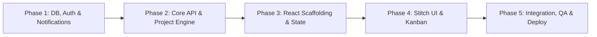

# Sylo — Spec-Driven Development (SDD) Constitution: Implementation Roadmap

**Project Name**: Sylo (Project & Task Management App)  
**Document Status**: Approved Baseline  
**Version**: 1.0  
**Stack**: MERN (MongoDB, Express.js, React, Node.js)  
**Source PRD**: `Project_Management_App_PRD_v1.0.pdf`  
**Design Reference**: Google Stitch Project `17067369580908098964`  

---

## 1. Phased Execution Strategy Overview

The Sylo MVP implementation is structured into **5 sequential phases**. Each phase builds strictly on the validated foundations of the previous phase, enforcing continuous integration, clear ownership boundaries for the 4-member team, and unambiguous verification milestones.



| Phase | Title | Focus & Core Objective | Primary PRD Deliverables |
| :--- | :--- | :--- | :--- |
| **Phase 1** | **Database & Auth Backend** | MongoDB schemas, JWT auth, input validation, and Nodemailer email pipeline. | FR-01 to FR-08, BR-16, AC-01, AC-02 |
| **Phase 2** | **Core API & Project Logic** | RESTful Project/Task controllers, RBAC middleware, progress derivation, and overdue cron. | FR-09 to FR-33, BR-01 to BR-15, AC-03 to AC-13 |
| **Phase 3** | **React Scaffolding & State** | Vite React app setup, Tailwind Stitch token injection, React Router v6, Axios interceptors, Context API. | FR-34, FR-37, FR-39, Non-Functional Architecture |
| **Phase 4** | **UI Implementation & Stitch Sync**| Building pages and components matching Stitch designs (Dashboard, Kanban, Modals, Team table). | Screens 01-24, FR-35, FR-39, UI/UX Consistency |
| **Phase 5** | **Integration, E2E QA & Deployment**| End-to-end integration, 11-step E2E acceptance verification, Swagger/Postman docs, and production deploy. | AC-01 to AC-15, Appendix A Checklist |

---

## 2. Granular Phase Breakdown

### Phase 1: Database Foundation, Authentication & Notification Engine

#### 1.1 Objective
Establish the server infrastructure, database models with schema validations, secure JWT authentication with bcrypt password hashing, and the Nodemailer transactional email delivery pipeline.

#### 1.2 Key Deliverables & Code Artifacts
* `server/config/db.js`: Resilient MongoDB connection utilizing Mongoose with pooling.
* `server/models/User.js`: User schema featuring lowercase normalized `username` (unique) and `email` (unique), bcrypt pre-save password hash hooks, and token fields.
* `server/middleware/validate.js`: `express-validator` rules for registration, login, and password reset (FR-37).
* `server/middleware/auth.js`: JWT token extraction, decoding, user verification, and email confirmation status check (FR-07).
* `server/services/emailService.js`: Nodemailer transport service generating HTML templates for:
  1. Email verification link with 24h expiration token (FR-03).
  2. Welcome confirmation message post-verification (FR-05).
  3. Secure password-reset token link with 1h expiration (FR-08).
* `server/controllers/authController.js`: Handlers for `/register`, `/verify-email/:token`, `/login`, `/me`, `/forgot-password`, `/reset-password/:token`.
* `server/routes/authRoutes.js`: Exposed Express routes with validation middleware.

#### 1.3 PRD Requirements Addressed
* **Functional Requirements**: FR-01, FR-02, FR-03, FR-04, FR-05, FR-06, FR-07, FR-08, FR-37, FR-38.
* **Business Rules**: BR-16 (unique username validation and case-insensitivity).
* **Acceptance Criteria**: AC-01, AC-02.

#### 1.4 Definition of Done (DoD) & Verification
1. User registration succeeds with valid data and rejects duplicates or weak passwords.
2. Verification email is dispatched with valid cryptographic token; clicking verifies the account.
3. Unverified accounts cannot authenticate (HTTP 403 response).
4. Verified account receives welcome email and can log in, receiving a signed JWT.
5. Password reset flow dispatches reset email; user can submit new password; old password fails; new password succeeds.
6. All automated unit tests for auth endpoints pass (`npm run test:auth`).

---

### Phase 2: Core REST API, Business Logic & Project-Task Engine

#### 2.1 Objective
Implement the relational domain models for Projects and Tasks, project-specific role-based access control (RBAC), multi-assignee task operations, cascade collaborator cleanup, formula-based progress calculation, and the overdue notification background scheduler.

#### 2.2 Key Deliverables & Code Artifacts
* `server/models/Project.js`: Project schema with `owner`, `collaborators`, `deadline`, and cascade pre-delete hooks.
* `server/models/Task.js`: Task schema with `project`, `assignees`, `status` (`'To Do'`, `'In Progress'`, `'Completed'`), `deadline`, and dynamic `isOverdue` virtual.
* `server/middleware/projectAuth.js`:
  * `requireProjectMember`: Ensures user belongs to the project (Admin or Collaborator) (BR-09).
  * `requireProjectAdmin`: Ensures `project.owner.equals(req.user._id)` (FR-12, FR-13, FR-19, FR-21, FR-28).
  * `requireTaskAssigneeOrAdmin`: Ensures only designated assignees or the Project Admin can update task status (FR-27, BR-10).
* `server/controllers/projectController.js`:
  * `createProject`: Sets creator as owner (FR-09, FR-10, BR-02).
  * `getUserProjects`: Returns all projects where user is owner or collaborator (FR-11, FR-34).
  * `getProjectById`: Returns project with populated members, task list, and dynamically computed progress (`Completed / Total * 100`) and derived status (FR-32, FR-33, BR-12, BR-13).
  * `updateProject`: Modifies project details (Admin only) (FR-12).
  * `deleteProject`: Hard deletes project and associated tasks (Admin only) (FR-13, BR-03).
  * `addCollaborator`: Adds member by exact registered username (Admin only) (FR-14).
  * `removeCollaborator`: Removes member and atomically unassigns them from all project tasks (Admin only) (FR-15, FR-16, BR-07, AC-10).
  * `leaveProject`: Collaborator self-exit; unassigns from project tasks without deleting project (FR-18, BR-04, AC-12).
* `server/controllers/taskController.js`:
  * `createTask`: Admin creates task; validates assignees belong to project (FR-19, FR-22, FR-23, FR-24, BR-05, BR-06).
  * `updateTask`: Admin updates details, due date, assignees (FR-21, FR-28).
  * `updateTaskStatus`: Assignee or Admin updates status (`To Do` $\rightarrow$ `In Progress` $\rightarrow$ `Completed`) (FR-26, FR-27, BR-10, BR-11).
  * `deleteTask`: Admin deletes task (FR-21).
* `server/services/cronService.js`: `node-cron` daemon running daily overdue checks and dispatching reminder emails (FR-31, BR-14, AC-09).

#### 2.3 PRD Requirements Addressed
* **Functional Requirements**: FR-09 to FR-33, FR-36, FR-37, FR-38.
* **Business Rules**: BR-01 to BR-15.
* **Acceptance Criteria**: AC-03 to AC-13.

#### 2.4 Definition of Done (DoD) & Verification
1. Full project CRUD functioning with proper Admin/Collaborator permission guards.
2. Collaborator added by username appears in project member list.
3. Adding non-existent username returns clear 404/400 error message.
4. Collaborator cannot perform Admin actions (update title, delete project, create tasks, set deadlines); server strictly returns HTTP 403.
5. Collaborator assigned to Task 1 can update Task 1 status; unassigned Collaborator attempting update on Task 2 receives HTTP 403.
6. Progress calculation responds immediately to status mutations: 0 tasks = 0%; 5/10 tasks = 50% (`Active`); 15/20 tasks = 75% (`Almost Done`); 8/8 tasks = 100% (`Completed`).
7. Removing collaborator purges their ID from task `assignees` array across all project tasks.
8. Daily cron correctly queries overdue incomplete tasks and fires email alerts.

---

### Phase 3: Frontend Scaffolding, Routing & Global State Architecture

#### 3.1 Objective
Initialize the client single-page application using React 18 and Vite, configure the exact Tailwind CSS design tokens from Google Stitch, implement React Router v6 navigation with protected route guards, and construct global state contexts via the React Context API.

#### 3.2 Key Deliverables & Code Artifacts
* `client/vite.config.js`: Optimized Vite configuration with path aliases (`@/components`, `@/context`, etc.).
* `client/tailwind.config.js`: Exhaustive Stitch token integration (Colors: `primary`, `surface-container-*`, Typography: `Inter`, `JetBrains Mono`, Spacing, Border Radii).
* `client/src/index.css`: Tailwind directives, `@layer base` resets, and Google Font imports for `Inter`, `JetBrains Mono`, and `Material Symbols Outlined`.
* `client/src/services/api.js`: Centralized Axios instance with request interceptor injecting `Authorization: Bearer <token>` and response interceptor handling HTTP 401 token invalidation.
* `client/src/context/AuthContext.jsx`: Provides `user`, `token`, `isAuthenticated`, `isLoading`, `login()`, `register()`, `logout()`.
* `client/src/context/ProjectContext.jsx`: Provides `projects`, `activeProject`, `tasks`, `fetchProjects()`, `fetchProjectDetails()`, `updateTaskStatus()`.
* `client/src/context/ToastContext.jsx`: Toast notification queue and dispatchers (`showToast(message, 'success' | 'error')`).
* `client/src/components/layout/ProtectedRoute.jsx`: Client-side route guard redirecting unauthenticated sessions to `/login`.
* `client/src/components/layout/AppLayout.jsx`: Stitch responsive layout shell (fixed desktop sidebar `w-64`, sticky header `h-16`, scrollable content pane, mobile navigation drawer).

#### 3.3 PRD Requirements Addressed
* **Functional Requirements**: FR-06, FR-07, FR-34, FR-36, FR-39.
* **Non-Functional Architecture**: Single connected React application, Axios error handling, Context API state sharing, design token alignment.

#### 3.4 Definition of Done (DoD) & Verification
1. React application builds without errors using Vite (`npm run build`).
2. Tailwind utilities generate exact Stitch hex codes and typography classes.
3. Accessing `/dashboard` or `/projects` while unauthenticated redirects immediately to `/login`.
4. Successful login stores JWT securely in `localStorage` and redirects to `/dashboard`.
5. Axios interceptor automatically appends the Bearer token to all outgoing requests and catches 401 errors cleanly.

---

### Phase 4: UI Implementation & Stitch Design System Synchronization

#### 4.1 Objective
Translate the Google Stitch UI screens into responsive React components and interactive pages, supporting both desktop and mobile viewports with role-conditioned action interfaces.

#### 4.2 Key Deliverables & Code Artifacts
* **Atoms & Molecules**:
  * `Button.jsx`: Primary (`bg-primary-container text-on-primary`), Secondary (`bg-surface-container-low`), Danger (`bg-error text-on-error`), Ghost.
  * `Input.jsx` & `SearchBar.jsx`: Search inputs with leading search icon and focus glow rings.
  * `Badge.jsx`: Status indicators for `Active`, `Almost Done`, `Completed`, `Overdue`, `High Priority`.
  * `MetricCard.jsx`: Stitch dashboard card with background accent glow watermark, count, delta label, and mini progress bar.
* **Organisms & Modals**:
  * `CreateProjectModal.jsx` (Screen 20): Modal dialog for title, description, and target deadline.
  * `CreateTaskModal.jsx` (Screen 18): Modal with task title, markdown description editor, project selector, assignee multi-select, and due date.
  * `KanbanBoard.jsx` (Screens 16 & 17): Three-column board (`TO DO`, `IN PROGRESS`, `COMPLETED`) with card drag/click status updating.
  * `TeamMembersTable.jsx` (Screen 21): Table listing collaborators, role badge (`Admin` vs `Member`), active tasks count, and remove button.
* **Full Application Pages**:
  * `SplashPage.jsx` (Screens 01 & 08): Welcome screen with login/register CTA.
  * `LoginPage.jsx` & `RegisterPage.jsx` (Screens 02, 09, 10): Clean authentication cards.
  * `ForgotPasswordPage.jsx` (Screens 03 & 11): Password recovery request form.
  * `DashboardPage.jsx` (Screens 04 & 12): 4-card metric overview, active sprint progress, recent projects grid.
  * `ProjectsPage.jsx` (Screens 05 & 13): All projects grid with search, filter tabs (`All`, `Active`, `Completed`), and `New Project` modal trigger.
  * `ProjectDetailsPage.jsx` (Screens 06 & 14): Project header, progress banner, task list / table, filter controls.
  * `TeamMembersPage.jsx` (Screen 21): Team member directory with `Add Member by Username` modal.
  * `SettingsPage.jsx` (Screens 07 & 15): User profile summary and password update.
  * `EmptyState.jsx` (Screen 24): Guided onboarding checklist for users with zero projects.

#### 4.3 PRD Requirements Addressed
* **Functional Requirements**: FR-11, FR-14, FR-19, FR-20, FR-26, FR-30, FR-32, FR-33, FR-34, FR-35, FR-39.
* **Business Rules**: BR-09, BR-10, BR-11, BR-12, BR-13, BR-14, BR-15.

#### 4.4 Definition of Done (DoD) & Verification
1. Visual fidelity of Dashboard, Projects, Kanban, and Modals matches Google Stitch design system.
2. Responsive behavior verified on both Desktop (1440px / 1920px) and Mobile (390px / 780px).
3. Role-conditioned rendering verified: Collaborator sees project tasks and details, but Admin buttons (`+ New Project`, `Add Collaborator`, `Delete Project`, `Edit Details`) are cleanly hidden (FR-35).
4. Assigned collaborator can click task status or move card to trigger status update; progress bar and status badge recalculate in real time without page refresh.
5. Incomplete tasks past deadline render red `Overdue` pill.

---

### Phase 5: Integration, End-to-End Verification & QA

#### 5.1 Objective
Execute end-to-end integration testing covering the complete user journey and permission boundaries, document the REST API via Swagger/OpenAPI and Postman, and prepare the production deployment configuration.

#### 5.2 Key Deliverables & Code Artifacts
* `server/docs/swagger.js`: OpenAPI 3.0 specification documented with `swagger-ui-express` accessible at `/api-docs` (PRD Section 10).
* `postman/Sylo_MVP_Collection.json`: Exported Postman collection containing pre-configured environments, saved requests, and auth Bearer token helpers.
* `tests/e2e/workflow.test.js`: Automated integration script running the canonical 11-step end-to-end user scenario.
* `server/middleware/errorHandler.js`: Production-hardened centralized error middleware formatting structured error responses without leaking internal stack traces (FR-38).
* `docker-compose.yml` or deployment scripts: Production containerization and environment manifest.

#### 5.3 PRD Requirements Addressed
* **Acceptance Criteria**: AC-01 through AC-15.
* **Appendix A Checklist**: All checkpoints passed.

#### 5.4 Canonical 11-Step Acceptance Journey Execution
```
[Step 1]  Create User A (alex_admin) & User B (sarah_dev) -> Both verify email via token.
[Step 2]  Log in as User A -> Dashboard loads -> Click 'New Project' -> Create "Sylo Web App".
[Step 3]  User A opens Project Members -> Inputs username "sarah_dev" -> User B added as Collaborator.
[Step 4]  User A creates Task 1 ("Design System") assigned to User B.
          User A creates Task 2 ("API Endpoints") assigned to both User A and User B.
[Step 5]  User A sets deadlines on Task 1 and Task 2.
[Step 6]  Log in as User B -> Opens "Sylo Web App" -> Sees both tasks -> Updates Task 1 status to 'Completed'.
[Step 7]  Verify User B cannot delete/update shared project, assign users, or alter deadlines (UI hides controls, API returns 403).
[Step 8]  Log in as User A -> Confirms Task 1 is 'Completed' -> Progress automatically recalculated to 50% ('Active').
[Step 9]  User A removes User B from Task 2 -> Confirms User B remains a project collaborator.
[Step 10] User A removes User B from the project -> Confirms User B is purged from all project task assignments and cannot access the project.
[Step 11] Execute Forgot Password flow for User A; verify loading skeletons across UI; verify overdue task email trigger.
```

---

## 3. Team Lead Review Checklist (Appendix A Operationalized)

As prescribed in Appendix A of the PRD, the lead architect conducts review gates at critical transitions:

| Checkpoint | Gate Question & Verification Focus | Gate Approval Criteria |
| :--- | :--- | :--- |
| **1. Before Database Design** | Can every team member explain the problem, target users, core workflow, roles, MVP scope, and business rules? | Unanimous team walkthrough of `mission.md`. |
| **2. Database Review** | Does the data model support project-specific ownership, collaborators, multiple assignees, deadlines, status, and leave/remove behavior? | Mongoose schemas pass cascade unassignment tests. |
| **3. API Review** | Does every frontend action have a clear endpoint/response, and are Admin/Collaborator permissions explicit? | Endpoint catalog matches `techstack.md`; Swagger documentation complete. |
| **4. UI Review** | Can both roles understand the same project information while seeing only actions they are allowed to perform? | Stitch screen parity confirmed; role-conditional rendering verified. |
| **5. Task Distribution** | Does every team member have a clear deliverable, dependencies, branch, and definition of done? | Jira/GitHub project boards mapped to Phase 1–5 tasks. |
| **6. Pull Request Review** | Was the feature tested locally? Does it match PRD/API contract? Are permissions enforced on the backend? | No PR merged without unit tests, lint validation, and 403 authorization checks. |
| **7. Integration Review** | Do frontend, backend, database, and email flows work together rather than as isolated pieces? | Live test with Nodemailer Ethereal inbox verifies email delivery. |
| **8. MVP Freeze** | When someone proposes a new feature, does it support the core journey strongly enough to justify changing the PRD? | Strict adherence to Section 11 (Out of Scope); new ideas deferred to v2.0. |
| **9. Final Test** | Can a brand-new user complete the end-to-end acceptance flow without manual database edits or developer intervention? | 11-step E2E canonical journey passes seamlessly. |
| **10. Tech Stack Review** | Has the team agreed on MERN, Tailwind, Axios, JWT, bcrypt, and Nodemailer? | All technologies locked in `techstack.md`. |

---

## 4. Risk Register & Mitigation Strategy

| Risk Item | Impact | Probability | Proactive Mitigation Strategy |
| :--- | :---: | :---: | :--- |
| **1. SMTP Transport Failure / Rate Limits** | High | Med | In development, use Nodemailer Ethereal sandbox (auto-generates ephemeral test mailboxes with direct web view URLs). Fallback to console logger if network is offline. |
| **2. Role Permission Escalation via Client Modification** | High | Low | Never trust client state. Express middleware (`requireProjectAdmin`, `requireTaskAssigneeOrAdmin`) independently queries MongoDB before executing any mutation. |
| **3. Orphan Task Assignees on Member Removal** | Med | Med | Mongoose atomic `$pull` query cleanses `task.assignees` across the entire project collection in the same database transaction/operation as member removal. |
| **4. Mobile Responsive Layout Breakage** | Med | Med | All Stitch screens provide both Desktop and Mobile specifications. Use Tailwind responsive prefixes (`md:`, `lg:`) and test across standard viewport break points (390px, 768px, 1280px). |
| **5. Division-by-Zero in Progress Calculation** | Low | Low | Formalized logic: `if (totalTasks === 0) return 0;` embedded in both backend virtuals and frontend calculation utilities. |
