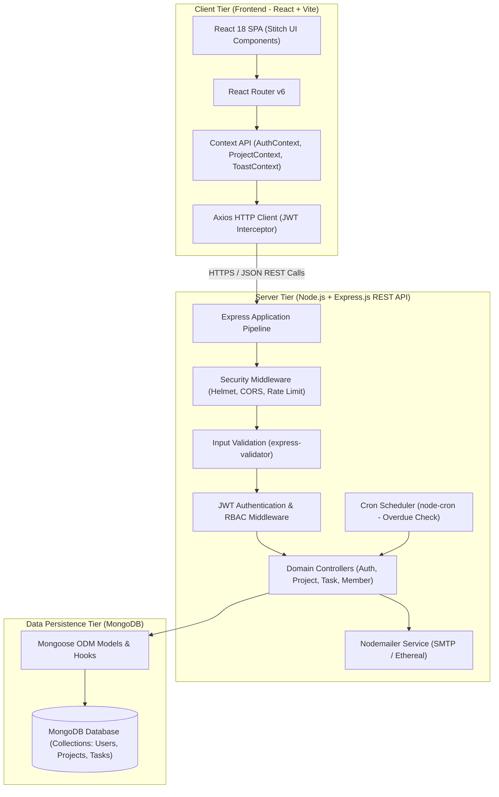
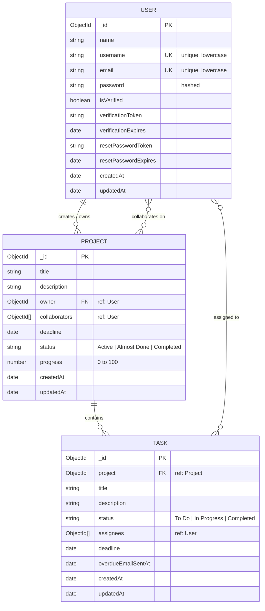

# Sylo — Spec-Driven Development (SDD) Constitution: Technical Stack & Architecture

**Project Name**: Sylo (Project & Task Management App)  
**Document Status**: Approved Baseline  
**Version**: 1.0  
**Stack**: MERN Architecture (MongoDB, Express.js, React, Node.js)  
**Design Reference**: Google Stitch Project `17067369580908098964`  

---

## 1. Architectural Overview & System Topology

Sylo is engineered as a decoupled, full-stack web application following the **MERN** (MongoDB, Express.js, React.js, Node.js) architectural pattern. The system adheres to strict separation of concerns across presentation, domain logic, data persistence, and background asynchronous jobs.



---

## 2. Core Technology Stack & Library Matrix

| Layer / Concern | Chosen Technology | Version / Tooling | Strategic Purpose & Justification |
| :--- | :--- | :--- | :--- |
| **Frontend Framework** | **React.js** | `^18.3` | Component-driven UI, declarative state binding, fast virtual DOM rendering for dynamic boards and dashboards. |
| **Build Tooling** | **Vite** | `^5.x` | Ultra-fast HMR (Hot Module Replacement) and optimized production bundle compilation. |
| **Client Routing** | **React Router DOM** | `^6.22` | Declarative routing, nested layout routes, and role-based client navigation guards (`<ProtectedRoute>`). |
| **API Client** | **Axios** | `^1.6` | HTTP client with automatic JSON transformation, global error handling, and request/response interceptors for Bearer token injection. |
| **Frontend State** | **React Context API** | Built-in | Lightweight, native state distribution for authentication credentials, active project metadata, and UI toasts without external state bloat. |
| **CSS & Design Engine**| **Tailwind CSS** | `^3.4` | Utility-first styling configured with the exact design tokens extracted from Google Stitch. |
| **Iconography** | **Material Symbols Outlined** | Google Fonts | Crisp, scalable icon font matching Stitch screen specifications (`hub`, `dashboard`, `add_task`, etc.). |
| **Backend Runtime** | **Node.js** | `>=18.x LTS` | Event-driven, non-blocking I/O runtime suited for concurrent REST transactions. |
| **Web Application Engine**| **Express.js** | `^4.19` | Minimalist, mature web framework for RESTful routing, middleware orchestration, and error isolation. |
| **Database & ODM** | **MongoDB + Mongoose** | `^8.2` | Document database providing flexible JSON schemas, populated references, compound indexing, and lifecycle cascade hooks. |
| **Authentication & Tokens**| **jsonwebtoken (JWT)** | `^9.0` | Stateless authentication tokens signed with HS256 containing user identity claims (`id`, `email`, `username`). |
| **Password Security** | **bcryptjs** | `^2.4` | Salted one-way hashing (10–12 salt rounds) guaranteeing secure credential storage. |
| **Input Validation** | **express-validator** | `^7.0` | Declarative schema validation ensuring request inputs are sanitised before reaching controller logic (FR-37). |
| **Email Automation** | **Nodemailer** | `^6.9` | Transactional email delivery for email verification, welcome alerts, password reset tokens, and overdue notices. |
| **Task Scheduling** | **node-cron** | `^3.0` | In-process daemon executing periodic sweeps for overdue task deadlines and reminder email dispatch. |
| **Security & Hardening**| **Helmet + CORS** | `helmet ^7.x`, `cors ^2.8` | HTTP header protection, cross-origin resource sharing restriction, and content security policy enforcement. |
| **Configuration** | **dotenv** | `^16.4` | 12-factor application configuration isolating secrets, keys, and ports from source control. |
| **API Documentation** | **Swagger UI + OpenAPI** | `swagger-ui-express ^5.0` | Interactive endpoint testing and visual OpenAPI 3.0 specification contract (FR-38, AC-15). |

---

## 3. Database Schema Models (Mongoose Specifications)

The database schema is organized into three normalized core collections with indexed foreign references and lifecycle middleware.



### 3.1 User Schema (`models/User.js`)
```javascript
const mongoose = require('mongoose');
const bcrypt = require('bcryptjs');

const userSchema = new mongoose.Schema({
  name: {
    type: String,
    required: [true, 'Full name or company name is required'],
    trim: true,
    maxlength: 100
  },
  username: {
    type: String,
    required: [true, 'Username is required'],
    unique: true,
    trim: true,
    lowercase: true,
    match: [/^[a-z0-9_-]{3,20}$/, 'Username must be 3-20 alphanumeric characters, hyphens or underscores'],
    index: true
  },
  email: {
    type: String,
    required: [true, 'Email is required'],
    unique: true,
    trim: true,
    lowercase: true,
    match: [/^\S+@\S+\.\S+$/, 'Please enter a valid email address'],
    index: true
  },
  password: {
    type: String,
    required: [true, 'Password is required'],
    minlength: 8,
    select: false // Never return password hash in queries by default
  },
  isVerified: {
    type: Boolean,
    default: false
  },
  verificationToken: String,
  verificationExpires: Date,
  resetPasswordToken: String,
  resetPasswordExpires: Date
}, {
  timestamps: true
});

// Pre-save password hashing hook
userSchema.pre('save', async function (next) {
  if (!this.isModified('password')) return next();
  const salt = await bcrypt.genSalt(10);
  this.password = await bcrypt.hash(this.password, salt);
  next();
});

// Password verification method
userSchema.methods.comparePassword = async function (candidatePassword) {
  return await bcrypt.compare(candidatePassword, this.password);
};

module.exports = mongoose.model('User', userSchema);
```

### 3.2 Project Schema (`models/Project.js`)
```javascript
const mongoose = require('mongoose');

const projectSchema = new mongoose.Schema({
  title: {
    type: String,
    required: [true, 'Project title is required'],
    trim: true,
    maxlength: 120
  },
  description: {
    type: String,
    trim: true,
    default: ''
  },
  owner: {
    type: mongoose.Schema.Types.ObjectId,
    ref: 'User',
    required: true,
    index: true
  },
  collaborators: [{
    type: mongoose.Schema.Types.ObjectId,
    ref: 'User'
  }],
  deadline: {
    type: Date,
    required: false
  }
}, {
  timestamps: true,
  toJSON: { virtuals: true },
  toObject: { virtuals: true }
});

// Compound indexes for performant dashboard and membership queries
projectSchema.index({ owner: 1 });
projectSchema.index({ collaborators: 1 });

// Cascade deletion middleware: deleting a project deletes all associated tasks
projectSchema.pre('deleteOne', { document: true, query: false }, async function (next) {
  await mongoose.model('Task').deleteMany({ project: this._id });
  next();
});

module.exports = mongoose.model('Project', projectSchema);
```

### 3.3 Task Schema (`models/Task.js`)
```javascript
const mongoose = require('mongoose');

const taskSchema = new mongoose.Schema({
  project: {
    type: mongoose.Schema.Types.ObjectId,
    ref: 'Project',
    required: [true, 'Task must belong to a project'],
    index: true
  },
  title: {
    type: String,
    required: [true, 'Task title is required'],
    trim: true,
    maxlength: 200
  },
  description: {
    type: String,
    trim: true,
    default: ''
  },
  status: {
    type: String,
    enum: {
      values: ['To Do', 'In Progress', 'Completed'],
      message: '{VALUE} is not a valid task status'
    },
    default: 'To Do',
    index: true
  },
  assignees: [{
    type: mongoose.Schema.Types.ObjectId,
    ref: 'User'
  }],
  deadline: {
    type: Date,
    default: null
  },
  overdueEmailSentAt: {
    type: Date,
    default: null
  }
}, {
  timestamps: true,
  toJSON: { virtuals: true },
  toObject: { virtuals: true }
});

// Compound index for querying project tasks and assignees
taskSchema.index({ project: 1, status: 1 });
taskSchema.index({ assignees: 1 });

// Virtual property to evaluate overdue status dynamically
taskSchema.virtual('isOverdue').get(function () {
  if (!this.deadline || this.status === 'Completed') return false;
  return new Date(this.deadline) < new Date();
});

module.exports = mongoose.model('Task', taskSchema);
```

---

## 4. Google Stitch Design System to Tailwind Config Translation

The frontend layout, typography hierarchy, colors, spacing, and component stylings are directly derived from the Google Stitch project tokens.

### 4.1 Color Palette Mapping
* **Primary Core**: `#003ec7` (Primary Blue), `#0052ff` (Primary Container), `#ffffff` (On-Primary), `#dfe3ff` (On-Primary Container)
* **Secondary**: `#3755c3` (Secondary Blue), `#708cfd` (Secondary Container), `#00217a` (On-Secondary Container)
* **Tertiary**: `#005851` (Teal), `#007369` (Tertiary Container), `#8bf7e9` (On-Tertiary Container)
* **Surface Hierarchy**:
  * `surface`: `#f8f9ff` (Canvas background)
  * `surface-container-lowest`: `#ffffff` (Clean card / modal elevation)
  * `surface-container-low`: `#eff4ff` (Pill backgrounds, secondary buttons, subtle wells)
  * `surface-container`: `#e5eeff` (Table headers, borders, inactive tabs)
  * `surface-container-high`: `#dce9ff` (Hover states, badges)
  * `surface-container-highest`: `#d3e4fe` (Muted indicators)
* **Text / Ink**:
  * `on-surface`: `#0b1c30` (High contrast primary ink)
  * `on-surface-variant`: `#434656` (Subtle secondary metadata ink)
  * `outline`: `#737688` (Border strokes & muted placeholders)
  * `outline-variant`: `#c3c5d9` (Light dividers)
* **Status & Alert**:
  * `error`: `#ba1a1a` (Destructive actions, overdue labels)
  * `error-container`: `#ffdad6` (Overdue pill background)
  * `on-error-container`: `#93000a` (Overdue text)

### 4.2 Tailwind Configuration (`tailwind.config.js`)

```javascript
/** @type {import('tailwindcss').Config} */
module.exports = {
  content: [
    "./index.html",
    "./src/**/*.{js,ts,jsx,tsx}",
  ],
  darkMode: "class",
  theme: {
    extend: {
      colors: {
        // Primary Brand
        "primary": "#003ec7",
        "primary-container": "#0052ff",
        "primary-fixed": "#dde1ff",
        "primary-fixed-dim": "#b7c4ff",
        "on-primary": "#ffffff",
        "on-primary-container": "#dfe3ff",
        "on-primary-fixed": "#001452",
        "on-primary-fixed-variant": "#0038b6",
        "inverse-primary": "#b7c4ff",

        // Secondary
        "secondary": "#3755c3",
        "secondary-container": "#708cfd",
        "secondary-fixed": "#dde1ff",
        "secondary-fixed-dim": "#b8c4ff",
        "on-secondary": "#ffffff",
        "on-secondary-container": "#00217a",
        "on-secondary-fixed": "#001453",
        "on-secondary-fixed-variant": "#173bab",

        // Tertiary (Success / Metric Accent)
        "tertiary": "#005851",
        "tertiary-container": "#007369",
        "tertiary-fixed": "#89f5e7",
        "tertiary-fixed-dim": "#6bd8cb",
        "on-tertiary": "#ffffff",
        "on-tertiary-container": "#8bf7e9",
        "on-tertiary-fixed": "#00201d",
        "on-tertiary-fixed-variant": "#005049",

        // Surface & Canvas
        "background": "#f8f9ff",
        "surface": "#f8f9ff",
        "surface-bright": "#f8f9ff",
        "surface-dim": "#cbdbf5",
        "surface-tint": "#004ced",
        "surface-variant": "#d3e4fe",
        "surface-container-lowest": "#ffffff",
        "surface-container-low": "#eff4ff",
        "surface-container": "#e5eeff",
        "surface-container-high": "#dce9ff",
        "surface-container-highest": "#d3e4fe",
        "inverse-surface": "#213145",
        "inverse-on-surface": "#eaf1ff",

        // Typography & Outlines
        "on-background": "#0b1c30",
        "on-surface": "#0b1c30",
        "on-surface-variant": "#434656",
        "outline": "#737688",
        "outline-variant": "#c3c5d9",

        // Feedback / Error
        "error": "#ba1a1a",
        "error-container": "#ffdad6",
        "on-error": "#ffffff",
        "on-error-container": "#93000a",
      },
      borderRadius: {
        "DEFAULT": "0.25rem",  // 4px
        "lg": "0.5rem",        // 8px
        "xl": "0.75rem",       // 12px
        "2xl": "1rem",         // 16px (Card containers)
        "full": "9999px"       // Circular pills / avatars
      },
      spacing: {
        "space-xs": "0.25rem", // 4px
        "space-sm": "0.5rem",  // 8px
        "space-md": "1rem",    // 16px
        "space-lg": "1.5rem",  // 24px
        "space-xl": "2rem",    // 32px
        "gutter": "1.5rem",    // 24px
        "gutter-mobile": "0.75rem", // 12px
        "margin": "2rem",      // 32px
        "margin-mobile": "1rem" // 16px
      },
      fontFamily: {
        sans: ["Inter", "sans-serif"],
        mono: ["JetBrains Mono", "monospace"],
        "display": ["Inter", "sans-serif"],
        "display-mobile": ["Inter", "sans-serif"],
        "headline-lg": ["Inter", "sans-serif"],
        "headline-md": ["Inter", "sans-serif"],
        "headline-sm": ["Inter", "sans-serif"],
        "body-lg": ["Inter", "sans-serif"],
        "body-md": ["Inter", "sans-serif"],
        "body-sm": ["Inter", "sans-serif"],
        "label-md": ["Inter", "sans-serif"],
        "label-sm": ["Inter", "sans-serif"],
        "mono-code": ["JetBrains Mono", "monospace"],
      },
      fontSize: {
        "display": ["36px", { lineHeight: "44px", letterSpacing: "-0.025em", fontWeight: "700" }],
        "display-mobile": ["28px", { lineHeight: "36px", letterSpacing: "-0.02em", fontWeight: "700" }],
        "headline-lg": ["24px", { lineHeight: "32px", letterSpacing: "-0.02em", fontWeight: "600" }],
        "headline-lg-mobile": ["20px", { lineHeight: "28px", letterSpacing: "-0.015em", fontWeight: "600" }],
        "headline-md": ["18px", { lineHeight: "26px", letterSpacing: "-0.01em", fontWeight: "600" }],
        "headline-sm": ["16px", { lineHeight: "24px", letterSpacing: "-0.005em", fontWeight: "600" }],
        "body-lg": ["16px", { lineHeight: "24px", letterSpacing: "0em", fontWeight: "400" }],
        "body-md": ["14px", { lineHeight: "20px", letterSpacing: "0em", fontWeight: "400" }],
        "body-sm": ["12px", { lineHeight: "16px", letterSpacing: "0.01em", fontWeight: "400" }],
        "label-md": ["13px", { lineHeight: "18px", letterSpacing: "0.01em", fontWeight: "500" }],
        "label-sm": ["11px", { lineHeight: "14px", letterSpacing: "0.04em", fontWeight: "600" }],
        "mono-code": ["12px", { lineHeight: "16px", letterSpacing: "0em", fontWeight: "500" }],
      },
      boxShadow: {
        'subtle': '0 1px 8px rgba(0,0,0,0.04)',
        'card': '0 2px 4px rgba(0,0,0,0.05)',
        'modal': '0 20px 25px -5px rgba(0, 0, 0, 0.1), 0 10px 10px -5px rgba(0, 0, 0, 0.04)',
      }
    },
  },
  plugins: [],
}
```

---

## 5. Frontend Component Hierarchy & Stitch Mapping

The frontend components follow an **Atomic Design** system strictly aligned with the Stitch UI screens:

```
src/
├── assets/
├── components/
│   ├── atoms/
│   │   ├── Button.jsx            (Primary, Secondary, Danger, Ghost variants)
│   │   ├── Input.jsx             (Text, Password, Search with leading icon)
│   │   ├── Badge.jsx             (Active, Almost Done, Completed, Overdue pills)
│   │   ├── Avatar.jsx            (User initial bubble or photo)
│   │   ├── ProgressBar.jsx       (Continuous percentage progress fill)
│   │   └── Icon.jsx              (Material Symbols Outlined wrapper)
│   ├── molecules/
│   │   ├── MetricCard.jsx        (Total Projects, Tasks, Completed with corner glow)
│   │   ├── TaskCard.jsx          (Title, status tag, due date, assignee avatars)
│   │   ├── SearchBar.jsx         (Debounced search bar with shortcut display)
│   │   ├── EmptyState.jsx        (Checklist onboarding illustration + action)
│   │   └── Toast.jsx             (Success, Error, Info floating alert)
│   ├── organisms/
│   │   ├── Sidebar.jsx           (Navigation links: Dashboard, Projects, Tasks, Settings)
│   │   ├── Header.jsx            (Search bar, New Project button, Notifications, User Menu)
│   │   ├── KanbanBoard.jsx       (Columns for 'To Do', 'In Progress', 'Completed')
│   │   ├── TasksTable.jsx        (Tabular view with status toggles and sortable headers)
│   │   ├── ProjectCard.jsx       (Project item with progress ring and collaborator pills)
│   │   ├── TeamMembersTable.jsx  (Member list, role badges, remove action)
│   │   ├── CreateProjectModal.jsx(Title, description, deadline modal)
│   │   └── CreateTaskModal.jsx   (Task title, markdown description, assignees, due date)
│   └── templates/
│       ├── AppLayout.jsx         (Sidebar + Sticky Header + Responsive Main Container)
│       └── AuthLayout.jsx        (Centered card with Sylo branding on light canvas)
├── context/
│   ├── AuthContext.jsx           (User, login, logout, register, verifyStatus)
│   ├── ProjectContext.jsx        (Active project, project list, tasks, refresh trigger)
│   └── ToastContext.jsx          (Toast notifications dispatcher)
├── services/
│   ├── api.js                   (Axios instance with JWT interceptor)
│   ├── authService.js           (Auth API endpoints)
│   ├── projectService.js        (Project CRUD & member management)
│   └── taskService.js           (Task CRUD & status updates)
└── pages/
    ├── SplashPage.jsx           (Screen 01 / 08: Welcome & Value Proposition)
    ├── LoginPage.jsx            (Screen 09: Credential entry)
    ├── RegisterPage.jsx         (Screen 02 / 10: Sign up form)
    ├── ForgotPasswordPage.jsx   (Screen 03 / 11: Email reset request)
    ├── ResetPasswordPage.jsx    (New password input with token)
    ├── DashboardPage.jsx        (Screen 04 / 12: Metric cards & recent projects)
    ├── ProjectsPage.jsx         (Screen 05 / 13: Project grid with filters)
    ├── ProjectDetailsPage.jsx   (Screen 06 / 14: Project tasks, progress, header)
    ├── KanbanPage.jsx           (Screen 16 / 17: Interactive 3-column Kanban)
    ├── TeamMembersPage.jsx      (Screen 21: Collaborator management table)
    └── SettingsPage.jsx         (Screen 07 / 15: Account settings & theme)
```

---

## 6. HTTP API Architecture & Standard Contract

### 6.1 Standard API Response Envelope
To satisfy **FR-38** and **Non-Functional Consistency Requirements**, every Express endpoint emits a structured JSON response envelope:

```json
// Success Response (HTTP 200 / 201)
{
  "success": true,
  "data": { ... },
  "message": "Operation completed successfully"
}

// Error Response (HTTP 400 / 401 / 403 / 404 / 500)
{
  "success": false,
  "message": "Human-readable explanation of error",
  "errors": [
    { "field": "username", "message": "Username already taken" }
  ]
}
```

### 6.2 Complete REST Endpoints Specification

#### A. Authentication & User Services (`/api/auth`)
* `POST /api/auth/register` — Register a new account (`name`, `username`, `email`, `password`). Dispatches verification email (FR-01, FR-02, FR-03).
* `GET /api/auth/verify-email/:token` — Confirms email verification token, activates user account, sends welcome email (FR-04, FR-05).
* `POST /api/auth/login` — Authenticates credentials, verifies active email status, issues JWT token (FR-06).
* `GET /api/auth/me` — Returns currently authenticated session profile (FR-07).
* `POST /api/auth/forgot-password` — Generates reset token and dispatches reset link email (FR-08).
* `POST /api/auth/reset-password/:token` — Validates reset token and updates password hash (FR-08).

#### B. Projects Management (`/api/projects`)
* `POST /api/projects` — Create project; sets `req.user._id` as owner (FR-09, FR-10, BR-02).
* `GET /api/projects` — List all projects where user is owner OR collaborator (FR-11, FR-34).
* `GET /api/projects/:id` — Get single project details, populated collaborators, and calculated progress (FR-11, FR-32).
* `PUT /api/projects/:id` — Update project metadata (Admin-only guard) (FR-12).
* `DELETE /api/projects/:id` — Delete project and cascade tasks (Admin-only guard) (FR-13, BR-03).
* `POST /api/projects/:id/collaborators` — Add collaborator by username (Admin-only guard) (FR-14, BR-16).
* `DELETE /api/projects/:id/collaborators/:userId` — Remove collaborator & clean up task assignments (Admin-only guard) (FR-15, FR-16, BR-07).
* `POST /api/projects/:id/leave` — Collaborator self-exit; cleans up user's task assignments (Collaborator-only) (FR-18, BR-04).

#### C. Tasks Management (`/api/tasks` & `/api/projects/:projectId/tasks`)
* `POST /api/projects/:projectId/tasks` — Create new task (Admin-only guard) (FR-19).
* `GET /api/projects/:projectId/tasks` — List all tasks in project (Member access) (FR-20).
* `PUT /api/tasks/:id` — Update task details, title, description, deadline, assignees (Admin-only guard) (FR-21, FR-22, FR-24).
* `DELETE /api/tasks/:id` — Delete task (Admin-only guard) (FR-21).
* `PATCH /api/tasks/:id/status` — Update task status to `'To Do' | 'In Progress' | 'Completed'` (Admin OR Task Assignee guard) (FR-26, FR-27, BR-10).

---

## 7. Middleware, Security & Email Engine Implementation

### 7.1 JWT Authentication Middleware (`middleware/auth.js`)
```javascript
const jwt = require('jsonwebtoken');
const User = require('../models/User');

const authenticate = async (req, res, next) => {
  try {
    const authHeader = req.header('Authorization');
    if (!authHeader || !authHeader.startsWith('Bearer ')) {
      return res.status(401).json({
        success: false,
        message: 'Access denied. No authentication token provided.'
      });
    }

    const token = authHeader.replace('Bearer ', '');
    const decoded = jwt.verify(token, process.env.JWT_SECRET);
    const user = await User.findById(decoded.id);

    if (!user) {
      return res.status(401).json({
        success: false,
        message: 'Invalid session token: user does not exist.'
      });
    }

    if (!user.isVerified) {
      return res.status(403).json({
        success: false,
        message: 'Account email address has not been verified.'
      });
    }

    req.user = user;
    next();
  } catch (err) {
    return res.status(401).json({
      success: false,
      message: 'Authentication session expired or invalid token.'
    });
  }
};

module.exports = authenticate;
```

### 7.2 Project Authorization Middleware (`middleware/projectAuth.js`)
```javascript
const Project = require('../models/Project');

// Checks if user is either Admin or Collaborator of project
const requireProjectMember = async (req, res, next) => {
  const projectId = req.params.projectId || req.params.id;
  const project = await Project.findById(projectId);
  if (!project) {
    return res.status(404).json({ success: false, message: 'Project not found' });
  }

  const isOwner = project.owner.equals(req.user._id);
  const isCollaborator = project.collaborators.some(id => id.equals(req.user._id));

  if (!isOwner && !isCollaborator) {
    return res.status(403).json({ success: false, message: 'Forbidden: You are not a member of this project' });
  }

  req.project = project;
  req.isProjectAdmin = isOwner;
  next();
};

// Strict Admin-only check
const requireProjectAdmin = async (req, res, next) => {
  await requireProjectMember(req, res, () => {
    if (!req.isProjectAdmin) {
      return res.status(403).json({
        success: false,
        message: 'Forbidden: Only the Project Admin can perform this action'
      });
    }
    next();
  });
};

module.exports = { requireProjectMember, requireProjectAdmin };
```

### 7.3 Email Automation Service (`services/emailService.js`)
```javascript
const nodemailer = require('nodemailer');

const transporter = nodemailer.createTransport({
  host: process.env.SMTP_HOST || 'smtp.ethereal.email',
  port: parseInt(process.env.SMTP_PORT || '587', 10),
  secure: process.env.SMTP_SECURE === 'true',
  auth: {
    user: process.env.SMTP_USER,
    pass: process.env.SMTP_PASS
  }
});

const sendVerificationEmail = async (user, token) => {
  const verifyUrl = `${process.env.CLIENT_URL}/verify-email/${token}`;
  await transporter.sendMail({
    from: `"Sylo Workspace" <${process.env.EMAIL_FROM || 'noreply@sylo.io'}>`,
    to: user.email,
    subject: 'Verify your Sylo account',
    html: `
      <h2>Welcome to Sylo, ${user.name}!</h2>
      <p>Please verify your email address to activate your project management workspace:</p>
      <a href="${verifyUrl}" style="background:#0052ff;color:#ffffff;padding:10px 20px;text-decoration:none;border-radius:6px;display:inline-block;">Verify Email</a>
      <p>This link will expire in 24 hours.</p>
    `
  });
};

const sendWelcomeEmail = async (user) => {
  await transporter.sendMail({
    from: `"Sylo Workspace" <${process.env.EMAIL_FROM || 'noreply@sylo.io'}>`,
    to: user.email,
    subject: 'Welcome to Sylo — Account Activated!',
    html: `<h3>Your Sylo workspace is ready, ${user.name}!</h3><p>You can now create projects, invite team members, and track deliverables.</p>`
  });
};

const sendPasswordResetEmail = async (user, token) => {
  const resetUrl = `${process.env.CLIENT_URL}/reset-password/${token}`;
  await transporter.sendMail({
    from: `"Sylo Workspace" <${process.env.EMAIL_FROM || 'noreply@sylo.io'}>`,
    to: user.email,
    subject: 'Reset your Sylo password',
    html: `<p>You requested a password reset. Click below to proceed:</p><a href="${resetUrl}">Reset Password</a>`
  });
};

const sendOverdueTaskAlert = async (user, task, project) => {
  await transporter.sendMail({
    from: `"Sylo Workspace" <${process.env.EMAIL_FROM || 'noreply@sylo.io'}>`,
    to: user.email,
    subject: `[Overdue Alert] Task "${task.title}" is past its deadline`,
    html: `
      <p>Hi ${user.name},</p>
      <p>The task <strong>${task.title}</strong> in project <strong>${project.title}</strong> was due on ${new Date(task.deadline).toLocaleDateString()} and remains incomplete.</p>
      <a href="${process.env.CLIENT_URL}/projects/${project._id}">View Task on Sylo</a>
    `
  });
};

module.exports = {
  sendVerificationEmail,
  sendWelcomeEmail,
  sendPasswordResetEmail,
  sendOverdueTaskAlert
};
```
