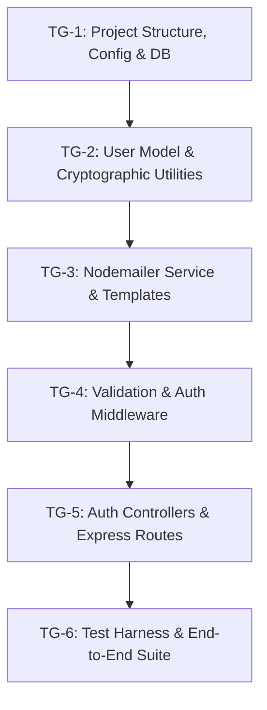

# Phase 1 Implementation Plan: Task Groups & Execution Order
## Database Foundation, Authentication & Notification Engine

**Project**: Sylo (Project & Task Management App)  
**Phase**: Phase 1  
**Status**: Ready for Execution  
**Target Duration**: 1 Sprint (4-person engineering team)  
**Prerequisites**: Approved SDD Constitution (`specs/constitution/`), Node.js LTS, MongoDB instance  

---

## 1. Execution Overview & Task Group Breakdown

Phase 1 establishes the server foundation, security subsystem, database schema, and transactional messaging engine. The work is decomposed into **6 sequential Task Groups**:



| Task Group ID | Title | Primary Responsibility | Target Files |
| :--- | :--- | :--- | :--- |
| **TG-1** | Project Scaffolding & DB Engine | Directory setup, npm packages, `.env`, Mongoose connection | `server/package.json`, `server/config/db.js`, `.env.example` |
| **TG-2** | User Model & Security Engine | Schema, bcrypt hooks, SHA-256 token hashing, JWT helper | `server/models/User.js`, `server/utils/jwt.js` |
| **TG-3** | Transactional Email Subsystem | Nodemailer transporter, Ethereal dev fallback, HTML templates | `server/services/emailService.js`, `server/templates/*.html` |
| **TG-4** | Middleware & Error Pipeline | Request sanitization, JWT auth guard, structured error handler | `server/middleware/validate.js`, `auth.js`, `errorHandler.js` |
| **TG-5** | Controllers & Route Assembly | Auth endpoints, business logic, Express route mounting | `server/controllers/authController.js`, `server/routes/authRoutes.js`, `server/app.js` |
| **TG-6** | Integration Testing & CI Gate | Jest + Supertest test suite, mock SMTP checks, security audits | `server/tests/auth.test.js`, `server/tests/email.test.js` |

---

## 2. Granular Task Group Specifications

### Task Group 1: Project Scaffolding, Environment Config & Database Connection (TG-1)

#### 1.1 Objective
Initialize the Node.js/Express server workspace, install production and development dependencies, establish environment variable schema, and construct a resilient MongoDB connection module.

#### 1.2 Step-by-Step Implementation Steps
1. **Initialize Server Directory**:
   * Create `server/` root directory.
   * Run `npm init -y` inside `server/`.
2. **Install Dependencies**:
   * *Production*: `express`, `mongoose`, `dotenv`, `bcryptjs`, `jsonwebtoken`, `nodemailer`, `express-validator`, `cors`, `helmet`, `morgan`.
   * *Development*: `nodemon`, `jest`, `supertest`, `mongodb-memory-server` (for isolated testing).
3. **Configure Environment Variables (`server/.env.example`)**:
   ```ini
   PORT=5000
   NODE_ENV=development
   CLIENT_URL=http://localhost:5173
   MONGO_URI=mongodb://127.0.0.1:27017/sylo_dev
   JWT_SECRET=super_secret_jwt_encryption_key_change_in_production
   JWT_EXPIRES_IN=7d
   SMTP_HOST=smtp.ethereal.email
   SMTP_PORT=587
   SMTP_SECURE=false
   SMTP_USER=
   SMTP_PASS=
   EMAIL_FROM=no-reply@sylo.io
   ```
4. **Implement Database Connector (`server/config/db.js`)**:
   * Connect with options: auto-reconnect, connection pooling (`maxPoolSize: 10`).
   * Bind event listeners for `connected`, `error`, `disconnected`.
   * Graceful process termination handling (`SIGINT`, `SIGTERM`).
5. **Create Entrypoint Skeleton (`server/server.js`)**:
   * Load `dotenv.config()`.
   * Initialize Express app and connect to MongoDB.

#### 1.3 Verification Checkpoint (TG-1)
* Executing `npm run dev` boots the server on port 5000 and logs `MongoDB Connected successfully`.
* Disconnecting MongoDB logs a descriptive connection error without unhandled process termination.

---

### Task Group 2: User Model & Cryptographic Security Utilities (TG-2)

#### 2.1 Objective
Construct the Mongoose `User` entity featuring strict validation, bcrypt password hashing, token generation methods, and JWT utility functions.

#### 2.2 Step-by-Step Implementation Steps
1. **Implement `server/models/User.js`**:
   * Define fields: `name`, `username`, `email`, `password`, `isVerified`, `verificationToken`, `verificationExpires`, `resetPasswordToken`, `resetPasswordExpires`.
   * Apply regex validation: username (`^[a-z0-9_-]{3,20}$`) and email standard RFC format.
   * Enforce unique indexing on `username` and `email`.
   * Set `select: false` on `password`, `verificationToken`, and `resetPasswordToken`.
2. **Implement Password Hashing Middleware**:
   * Pre-save hook checking `this.isModified('password')`.
   * Generate salt with 10 rounds using `bcrypt.genSalt(10)` and hash password.
3. **Implement Schema Instance Methods**:
   * `comparePassword(candidatePassword)`: Returns boolean via `bcrypt.compare`.
   * `createEmailVerificationToken()`: Uses `crypto.randomBytes(32)` to generate a 64-char hex token, stores SHA-256 hash in `verificationToken`, sets `verificationExpires = Date.now() + 24 * 3600 * 1000`, returns unhashed raw token.
   * `createPasswordResetToken()`: Generates 64-char hex token, stores SHA-256 hash in `resetPasswordToken`, sets `resetPasswordExpires = Date.now() + 3600 * 1000`, returns unhashed raw token.
4. **Implement JWT Utility (`server/utils/jwt.js`)**:
   * `generateToken(user)`: Signs payload `{ id: user._id, username: user.username, email: user.email }` with `JWT_SECRET` and expiration `JWT_EXPIRES_IN`.
   * `verifyToken(token)`: Verifies signature and returns decoded payload.

#### 2.3 Verification Checkpoint (TG-2)
* Unit tests verify that creating a user hashes the password in MongoDB.
* Querying `User.findOne()` excludes the password and token fields by default.
* Calling `createEmailVerificationToken()` generates a 64-char string and stores a SHA-256 hash with valid 24h timestamp.

---

### Task Group 3: Transactional Email Subsystem & Stitch-Branded Templates (TG-3)

#### 3.1 Objective
Build the Nodemailer email service capable of running in development (using ephemeral Ethereal mail accounts with URL inspection) and production (standard SMTP), using responsive HTML templates matching the Sylo design system.

#### 3.2 Step-by-Step Implementation Steps
1. **Implement Nodemailer Transporter (`server/services/emailService.js`)**:
   * If `NODE_ENV === 'test'`, mock or bypass outbound SMTP calls.
   * If `SMTP_USER` is blank in development, auto-create an Ethereal test account via `nodemailer.createTestAccount()` and log the web preview URL (`nodemailer.getTestMessageUrl(info)`).
2. **Design HTML Templates with Sylo Brand Tokens**:
   * *Template 1 (`verificationEmail`)*: Includes recipient name, primary blue verification button (`#0052ff`), expiration notice, and direct link fallback.
   * *Template 2 (`welcomeEmail`)*: Congratulatory email confirming account activation, introducing quick-start guide, and CTA to login.
   * *Template 3 (`passwordResetEmail`)*: Security notice, reset password button, 1-hour expiration warning, and advisory to ignore if not requested.
3. **Export Transactional Dispatch Functions**:
   * `sendVerificationEmail(user, rawToken)`
   * `sendWelcomeEmail(user)`
   * `sendPasswordResetEmail(user, rawToken)`

#### 3.3 Verification Checkpoint (TG-3)
* Triggering a test dispatch creates an Ethereal preview link printed in the console.
* Opening the preview URL renders valid HTML with the correct token link parameters.

---

### Task Group 4: Validation Engine, Auth Middleware & Error Handling (TG-4)

#### 4.1 Objective
Implement declarative request body validation using `express-validator`, JWT authentication middleware for protected routes, and a global error handling pipeline adhering to the standard JSON envelope.

#### 4.2 Step-by-Step Implementation Steps
1. **Implement Validation Rules (`server/middleware/validate.js`)**:
   * `registerValidator`:
     * `name`: not empty, length 2–100.
     * `username`: matches `^[a-z0-9_-]{3,20}$`, lowercase sanitization.
     * `email`: valid email format, lowercase sanitization.
     * `password`: min 8 chars, regex checking uppercase, lowercase, and numeric characters.
   * `loginValidator`: `login` not empty, `password` not empty.
   * `forgotPasswordValidator`: `email` valid format.
   * `resetPasswordValidator`: `password` complexity check, `confirmPassword` matches `password`.
   * `handleValidationErrors`: Middleware checking `validationResult(req)` and emitting formatted 400 Bad Request error envelopes.
2. **Implement Authentication Guard (`server/middleware/auth.js`)**:
   * Extracts `Authorization` header (`Bearer <token>`).
   * Decodes JWT; returns 401 if missing, expired, or invalid.
   * Queries `User.findById(decoded.id)`.
   * Enforces `isVerified === true`; returns 403 Forbidden with specific message if unverified (FR-04, FR-07).
   * Attaches sanitized user record to `req.user`.
3. **Implement Centralized Error Handler (`server/middleware/errorHandler.js`)**:
   * Intercepts Mongoose duplicate key errors (code 11000) for `username` and `email`, converting them into clear 400 Bad Request errors (FR-38).
   * Intercepts Mongoose ValidationError and casts errors cleanly.
   * Returns standard JSON error structure `{ success: false, message, errors }`.

#### 4.3 Verification Checkpoint (TG-4)
* Sending malformed JSON or invalid usernames triggers HTTP 400 with a detailed `errors` array.
* Requesting protected endpoints without a token returns HTTP 401.
* Requesting protected endpoints with an unverified user's token returns HTTP 403.

---

### Task Group 5: Authentication Controllers & Express Route Assembly (TG-5)

#### 5.1 Objective
Construct the controller logic for all authentication operations and wire them to public/protected routes on the Express application.

#### 5.2 Step-by-Step Implementation Steps
1. **Implement `server/controllers/authController.js`**:
   * `register`:
     * Check if username or email is already taken.
     * Instantiate `new User(...)`.
     * Call `user.createEmailVerificationToken()`.
     * Save user.
     * Dispatch verification email asynchronously.
     * Return HTTP 201 Created.
   * `verifyEmail`:
     * Hash incoming parameter token via SHA-256.
     * Find user where `verificationToken === hashedToken` and `verificationExpires > Date.now()`.
     * If not found, return HTTP 400 (Invalid or expired token).
     * Set `isVerified = true`, clear token fields, save user.
     * Dispatch welcome email asynchronously.
     * Return HTTP 200 OK.
   * `resendVerification`:
     * Find user by email. If not found or already verified, return generic success (prevent email enumeration).
     * Call `user.createEmailVerificationToken()`, save, and resend email.
   * `login`:
     * Find user by username or email (selecting `+password`).
     * Compare password; return 401 if mismatched.
     * Verify `isVerified`; return 403 if unverified.
     * Issue signed JWT; return 200 OK with token and user object.
   * `getMe`:
     * Return profile of `req.user` (HTTP 200).
   * `forgotPassword`:
     * Find user by email. If not found, return 200 (security measure against user enumeration).
     * Call `user.createPasswordResetToken()`, save, dispatch reset email.
   * `resetPassword`:
     * Hash incoming parameter token via SHA-256.
     * Find user where `resetPasswordToken === hashedToken` and `resetPasswordExpires > Date.now()`.
     * If not found, return HTTP 400.
     * Set `user.password = req.body.password`, clear token fields, save user.
     * Return HTTP 200 OK.
2. **Configure Router (`server/routes/authRoutes.js`)**:
   * Connect validators and controller handlers to paths defined in `requirements.md`.
3. **Mount in Express Application (`server/app.js`)**:
   * Enable `helmet`, `cors`, `express.json()`, `morgan`.
   * Mount `/api/auth` routes.
   * Mount global error handler.

#### 5.3 Verification Checkpoint (TG-5)
* Manual or Postman verification confirms successful registration, verification, login, profile fetch, and password reset.

---

### Task Group 6: Test Suite, Security Verification & CI Gate (TG-6)

#### 6.1 Objective
Build an automated test suite verifying all Phase 1 acceptance criteria (AC-01, AC-02), edge cases, security controls, and error scenarios.

#### 6.2 Step-by-Step Implementation Steps
1. **Set Up Jest & Supertest Harness**:
   * Create `server/tests/setup.js` running with in-memory MongoDB (`mongodb-memory-server`).
2. **Implement Integration Tests (`server/tests/auth.test.js`)**:
   * *Test Suite 1: Registration (FR-01, FR-02, BR-16)*:
     * Happy path registration returns 201 and stores unverified user.
     * Duplicate username fails with 400.
     * Duplicate email fails with 400.
     * Weak password (< 8 chars, missing uppercase/digit) fails with 400.
   * *Test Suite 2: Verification Flow (FR-03, FR-04, FR-05, AC-01)*:
     * Valid token activates user and sends welcome email.
     * Expired token fails with 400.
     * Tampered/invalid token fails with 400.
   * *Test Suite 3: Login & Access Protection (FR-06, FR-07)*:
     * Unverified user login fails with 403.
     * Invalid credentials return 401.
     * Valid verified user receives signed JWT.
     * Accessing `/api/auth/me` with valid JWT returns profile.
     * Accessing `/api/auth/me` without JWT returns 401.
   * *Test Suite 4: Password Recovery (FR-08, AC-02)*:
     * Requesting reset for existing email dispatches reset token.
     * Resetting password with valid token updates password hash.
     * Logging in with old password fails (401); new password succeeds (200).
     * Reusing expired or previously used reset token fails with 400.
3. **Run Security & Code Quality Checks**:
   * Verify password hash is excluded from all JSON responses.
   * Verify SQL/NoSQL injection payload rejection on login fields.

#### 6.3 Verification Checkpoint (TG-6)
* `npm test` runs all integration suites and achieves 100% pass rate.
* Full compliance with Appendix A Phase 1 review checklist achieved.
