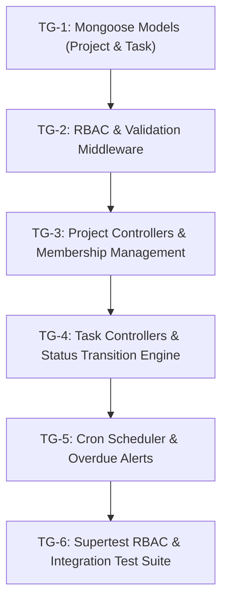

# Phase 2 Implementation Plan: Task Groups & Execution Order
## Core REST API, Business Logic & Project-Task Engine

**Project**: Sylo (Project & Task Management App)  
**Phase**: Phase 2  
**Status**: Ready for Execution  
**Target Duration**: 1 Sprint (4-person engineering team)  
**Prerequisites**: Phase 1 Complete (Authentication, User Model, Nodemailer, Security Middleware)  

---

## 1. Execution Overview & Task Group Breakdown

Phase 2 builds the core business domain of Sylo. The execution is partitioned into **6 logical Task Groups**:

| Task Group ID | Title | Primary Responsibility | Target Files |
| :--- | :--- | :--- | :--- |
| **TG-1** | Project & Task Models | Mongoose schemas, compound indexes, virtuals, cascade delete hooks | `server/models/Project.js`, `server/models/Task.js` |
| **TG-2** | RBAC & Validation Middleware | Project membership guards, Admin check, assignee check, input schemas | `server/middleware/projectAuth.js`, `server/middleware/validate.js` |
| **TG-3** | Project & Membership Controllers | Project CRUD, add collaborator by username, atomic unassignment | `server/controllers/projectController.js`, `server/routes/projectRoutes.js` |
| **TG-4** | Task & Status Mutation Engine | Task CRUD, status update (`To Do` $\rightarrow$ `Done`), progress derivation | `server/controllers/taskController.js`, `server/routes/taskRoutes.js` |
| **TG-5** | Cron Scheduler & Overdue Alerts | `node-cron` daemon, overdue queries, transactional overdue email | `server/services/cronService.js`, `server/services/emailService.js` |
| **TG-6** | Automated Integration Test Suite | Supertest suites for AC-03 to AC-13, RBAC 403 boundary checks | `server/tests/integration/project.integration.test.js`, `task.integration.test.js` |

---

## 2. Granular Task Group Specifications

### Task Group 1: Project & Task Mongoose Data Models (TG-1)

#### 1.1 Objective
Construct the Mongoose domain entities for `Project` and `Task` with relational references, indexes, cascade delete hooks, and dynamic virtual properties.

#### 1.2 Step-by-Step Implementation Steps
1. **Implement `server/models/Project.js`**:
   * Fields: `title`, `description`, `owner` (Ref User), `collaborators` ([Ref User]), `deadline`.
   * Indexes: `{ owner: 1 }`, `{ collaborators: 1 }`.
   * Virtual `isOverdue`: evaluates whether `deadline < new Date()`.
   * Pre-delete hook: automatically cascades deletion to all child tasks (`Task.deleteMany({ project: this._id })`) (BR-03).
2. **Implement `server/models/Task.js`**:
   * Fields: `project` (Ref Project), `title`, `description`, `status` (`'To Do'`, `'In Progress'`, `'Completed'`), `assignees` ([Ref User]), `deadline`, `overdueEmailSentAt`.
   * Compound indexes: `{ project: 1, status: 1 }`, `{ project: 1, assignees: 1 }`.
   * Virtual `isOverdue`: checks if `status !== 'Completed' && deadline < new Date()`.
3. **Write Model Unit Tests**:
   * Test schema validation constraints (min/max length, required fields, status enum).
   * Test `isOverdue` virtual logic on both models.

#### 1.3 Verification Checkpoint (TG-1)
* Unit tests confirm that invalid statuses (e.g. `'Blocked'`) are rejected by Mongoose validation.
* Deleting a project document purges all child tasks associated with that project ID.

---

### Task Group 2: RBAC & Validation Middleware Pipeline (TG-2)

#### 2.1 Objective
Implement role-based authorization middleware enforcing project-specific roles (`requireProjectMember`, `requireProjectAdmin`, `requireTaskAdmin`, `requireTaskAssigneeOrAdmin`) and input validators.

#### 2.2 Step-by-Step Implementation Steps
1. **Implement `server/middleware/projectAuth.js`**:
   * `requireProjectMember`: Resolves project by `:projectId` or `:id`. Verifies `req.user._id` matches `owner` or is present in `collaborators`. Returns 403 if not. Binds `req.project` and `req.isProjectAdmin`.
   * `requireProjectAdmin`: Verifies `project.owner.equals(req.user._id)`. Returns 403 Forbidden if user is only a collaborator.
   * `requireTaskAdmin`: Resolves task by `:id`, checks parent project owner, returns 403 if user is not project owner.
   * `requireTaskAssigneeOrAdmin`: Resolves task by `:id`, checks if user is parent project owner OR included in `task.assignees`. Returns 403 if unassigned collaborator.
2. **Expand Validation Rules (`server/middleware/validate.js`)**:
   * `createProjectValidator`: `title` required (1–120 chars).
   * `updateProjectValidator`: `title` optional/length-checked.
   * `addCollaboratorValidator`: `username` required, trimmed, lowercase.
   * `createTaskValidator`: `title` required (1–200 chars), `assignees` array of ObjectIds.
   * `updateTaskStatusValidator`: `status` required, must be in `['To Do', 'In Progress', 'Completed']`.

#### 2.3 Verification Checkpoint (TG-2)
* Middleware unit tests verify that a Collaborator calling an Admin-only endpoint receives HTTP 403.
* Validation unit tests verify invalid task statuses are rejected with HTTP 400.

---

### Task Group 3: Project Domain Controller & Membership Engine (TG-3)

#### 3.1 Objective
Build the controller logic and routes for project creation, listing, details inspection, metadata updates, deletion, collaborator addition by username, and collaborator departure/removal.

#### 3.2 Step-by-Step Implementation Steps
1. **Implement `server/controllers/projectController.js`**:
   * `createProject`: Sets `owner = req.user._id`. Returns 201 Created (FR-09, FR-10).
   * `getUserProjects`: Queries projects where `owner: req.user._id` OR `collaborators: req.user._id`. Computes task counts, progress %, and derived status (`Active`, `Almost Done`, `Completed`) for each project (FR-11, FR-32, FR-33, FR-34).
   * `getProjectById`: Returns detailed project record with populated members, task metrics breakdown, progress %, and role badge (FR-11).
   * `updateProject`: Modifies title, description, deadline (Admin only) (FR-12).
   * `deleteProject`: Deletes project document and child tasks (Admin only) (FR-13).
   * `addCollaborator`: Queries user by `username`. If not found, returns 404. If already owner or collaborator, returns 400. Adds user ID to `collaborators` array and saves (FR-14).
   * `removeCollaborator`: Removes target user from `project.collaborators` AND executes atomic `$pull` on all tasks in the project to unassign them (FR-15, FR-16, BR-07, AC-10).
   * `leaveProject`: Checks caller is not owner; removes user from `project.collaborators` and unassigns from project tasks (FR-18, BR-04, AC-12).
2. **Implement `server/routes/projectRoutes.js`**:
   * Connect routes with authentication and RBAC guards.
3. **Mount in `server/app.js`**:
   * Mount at `/api/projects`.

#### 3.3 Verification Checkpoint (TG-3)
* Integration test confirms project creation, adding collaborator by username, and dashboard listing.
* Removing a collaborator unassigns them from all project tasks while leaving task documents intact.

---

### Task Group 4: Task Domain Controller & Status Transition Engine (TG-4)

#### 4.1 Objective
Build the controller logic and routes for task creation, listing, updating, deletion, and status mutations, with real-time recalculation of project progress.

#### 4.2 Step-by-Step Implementation Steps
1. **Implement `server/controllers/taskController.js`**:
   * `createTask`: Admin-only. Validates that all IDs in `assignees` belong to `project.collaborators` or equal `project.owner` (FR-24, BR-06). Creates task and returns 201.
   * `getProjectTasks`: Member access. Returns all tasks for `:projectId` with populated assignees (FR-20). Supports filtering by status or assignee.
   * `updateTask`: Admin-only. Updates title, description, deadline, assignees (FR-21, FR-22).
   * `deleteTask`: Admin-only. Deletes task document (FR-21).
   * `updateTaskStatus`: Assignee or Admin only. Updates status (`'To Do'`, `'In Progress'`, `'Completed'`). Recalculates parent project progress and returns updated task plus new project metrics (FR-26, FR-27, BR-10, BR-12, BR-13, AC-07, AC-08).
2. **Implement `server/routes/taskRoutes.js`**:
   * Nested routes: `/api/projects/:projectId/tasks` (create, list).
   * Standalone task routes: `/api/tasks/:id` (update, delete), `/api/tasks/:id/status` (patch status).
3. **Mount in `server/app.js`**:
   * Mount task routes.

#### 4.3 Verification Checkpoint (TG-4)
* Assignee updating task status from `'In Progress'` to `'Completed'` causes project progress to recalculate immediately.
* Non-assignee collaborator attempting status update receives HTTP 403.

---

### Task Group 5: Cron Scheduler & Overdue Notification Service (TG-5)

#### 5.1 Objective
Implement the automated background scheduler using `node-cron` that sweeps for overdue incomplete tasks and dispatches transactional notification emails via Nodemailer.

#### 5.2 Step-by-Step Implementation Steps
1. **Add `sendOverdueTaskAlert` to `server/services/emailService.js`**:
   * HTML template styled with Sylo design tokens.
   * Includes task title, project title, due date, and direct CTA link to project.
2. **Implement `server/services/cronService.js`**:
   * Schedules daily cron job (`0 8 * * *` at 08:00 UTC).
   * Queries incomplete tasks where `deadline < new Date()` and `overdueEmailSentAt` is null or older than 24h.
   * Dispatches email to task assignees (or project owner if unassigned).
   * Updates `overdueEmailSentAt` to timestamp to prevent notification duplicates.
   * Exports `runOverdueCheckNow()` for automated testing and manual execution.
3. **Register Cron Service in `server/server.js`**:
   * Starts cron job on server boot.

#### 5.3 Verification Checkpoint (TG-5)
* Calling `runOverdueCheckNow()` with a past-deadline task dispatches an overdue alert email and updates `overdueEmailSentAt`.

---

### Task Group 6: Automated Integration Test Suite & Verification (TG-6)

#### 6.1 Objective
Construct an exhaustive Supertest integration suite verifying all acceptance criteria (AC-03 through AC-13) and security boundaries.

#### 6.2 Step-by-Step Implementation Steps
1. **Write `server/tests/integration/project.integration.test.js`**:
   * Verify AC-03: User creates project and becomes Admin.
   * Verify AC-04: Admin adds collaborator by registered username.
   * Verify AC-06: Collaborator cannot update project or delete project (403).
   * Verify AC-10: Removing collaborator purges user from all project task assignments.
   * Verify AC-12: Collaborator leaving project succeeds without deleting project.
2. **Write `server/tests/integration/task.integration.test.js`**:
   * Verify AC-05: Admin creates task and assigns members.
   * Verify AC-07: Assigned collaborator updates task status.
   * Verify AC-08: Progress recalculation matches formula (`(Completed/Total)*100`) and updates status (`Active`, `Almost Done`, `Completed`).
   * Verify Zero-Division Guard: Project with 0 tasks reports `progress: 0%`.
   * Verify AC-11: Removing user from a task preserves project membership.
   * Verify AC-13: Unassigned collaborator attempting status update receives HTTP 403.
3. **Run Full Test Suite**:
   * Execute `npm test` across all Phase 1 and Phase 2 suites.

#### 6.3 Verification Checkpoint (TG-6)
* 100% test pass rate across Phase 1 and Phase 2.
* Zero regressions on authentication or token verification.
