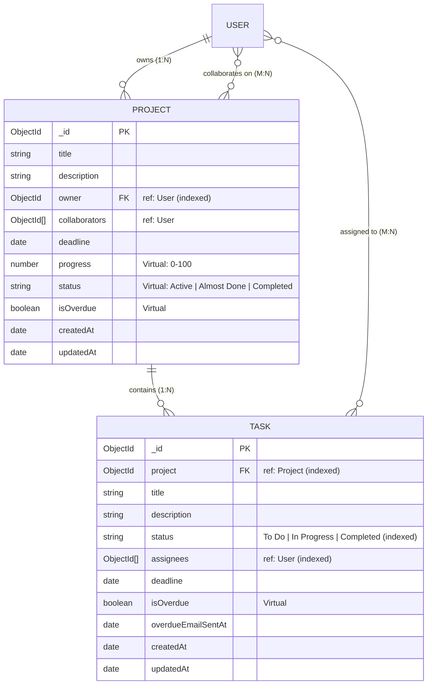

# Phase 2 Technical Specification: Requirements & API Contracts
## Core REST API, Business Logic & Project-Task Engine

**Project**: Sylo (Project & Task Management App)  
**Phase**: Phase 2  
**Status**: Approved Specification  
**Version**: 1.0  
**PRD Traceability**: FR-09 through FR-33, BR-01 through BR-15, AC-03 through AC-13, Section 5 (Roles & Permissions Matrix)  

---

## 1. Domain Entities & Mongoose Data Models

Phase 2 introduces two core relational entities: `Project` and `Task`. The schemas enforce data integrity, cascade cleanup rules, and calculated progress metrics.



---

### 1.1 Project Schema Specification (`server/models/Project.js`)

#### Data Dictionary
| Field Name | Type | Required | Constraints & Indexing | Default | Description |
| :--- | :--- | :---: | :--- | :--- | :--- |
| `_id` | `ObjectId` | Auto | Primary Key (BSON ObjectId) | Auto | Unique project identifier. |
| `title` | `String` | Yes | Trimmed, 1–120 characters | None | Human-readable title of project (FR-09). |
| `description`| `String` | No | Trimmed, max 2000 characters | `""` | Detailed description of scope and goals. |
| `owner` | `ObjectId` | Yes | Ref: `User`, Indexed | None | Creator/Admin of project (FR-10, BR-02). |
| `collaborators`| `[ObjectId]` | Yes | Array of Refs: `User`, Indexed | `[]` | Team members with collaborator access (FR-14). |
| `deadline` | `Date` | No | Valid Date or null | `null` | Target completion date (FR-28). |
| `createdAt` | `Date` | Auto | Managed by `timestamps: true` | Auto | Record creation timestamp. |
| `updatedAt` | `Date` | Auto | Managed by `timestamps: true` | Auto | Last modification timestamp. |

#### Schema Implementation Code
```javascript
const mongoose = require('mongoose');

const projectSchema = new mongoose.Schema({
  title: {
    type: String,
    required: [true, 'Project title is required'],
    trim: true,
    minlength: [1, 'Title cannot be empty'],
    maxlength: [120, 'Title cannot exceed 120 characters']
  },
  description: {
    type: String,
    trim: true,
    maxlength: [2000, 'Description cannot exceed 2000 characters'],
    default: ''
  },
  owner: {
    type: mongoose.Schema.Types.ObjectId,
    ref: 'User',
    required: [true, 'Project must have an owner/admin'],
    index: true
  },
  collaborators: [{
    type: mongoose.Schema.Types.ObjectId,
    ref: 'User'
  }],
  deadline: {
    type: Date,
    default: null
  }
}, {
  timestamps: true,
  toJSON: { virtuals: true },
  toObject: { virtuals: true }
});

// Indexes for high-frequency queries
projectSchema.index({ owner: 1 });
projectSchema.index({ collaborators: 1 });

// Virtual: Check if project is overdue
projectSchema.virtual('isOverdue').get(function () {
  if (!this.deadline) return false;
  return new Date(this.deadline) < new Date();
});

// Cascade Deletion Hook: When a project is deleted, delete all child tasks (BR-03)
projectSchema.pre('deleteOne', { document: true, query: false }, async function (next) {
  try {
    await mongoose.model('Task').deleteMany({ project: this._id });
    next();
  } catch (err) {
    next(err);
  }
});

projectSchema.pre('findOneAndDelete', async function (next) {
  try {
    const doc = await this.model.findOne(this.getFilter());
    if (doc) {
      await mongoose.model('Task').deleteMany({ project: doc._id });
    }
    next();
  } catch (err) {
    next(err);
  }
});

module.exports = mongoose.model('Project', projectSchema);
```

---

### 1.2 Task Schema Specification (`server/models/Task.js`)

#### Data Dictionary
| Field Name | Type | Required | Constraints & Indexing | Default | Description |
| :--- | :--- | :---: | :--- | :--- | :--- |
| `_id` | `ObjectId` | Auto | Primary Key (BSON ObjectId) | Auto | Unique task identifier. |
| `project` | `ObjectId` | Yes | Ref: `Project`, Indexed | None | Parent project foreign key (FR-19). |
| `title` | `String` | Yes | Trimmed, 1–200 characters | None | Actionable task title (FR-19). |
| `description`| `String` | No | Trimmed, markdown supported | `""` | Task instructions and acceptance notes. |
| `status` | `String` | Yes | Enum: `['To Do', 'In Progress', 'Completed']`, Indexed | `'To Do'` | Strict 3-state workflow state machine (FR-26, BR-11). |
| `assignees` | `[ObjectId]` | Yes | Array of Refs: `User`, Indexed | `[]` | Team members accountable for deliverable (FR-22, BR-05). |
| `deadline` | `Date` | No | Valid Date or null | `null` | Deliverable deadline (FR-28). |
| `overdueEmailSentAt`| `Date` | No | Timestamp or null | `null` | Prevents redundant notification spam (FR-31). |
| `createdAt` | `Date` | Auto | Managed by `timestamps: true` | Auto | Record creation timestamp. |
| `updatedAt` | `Date` | Auto | Managed by `timestamps: true` | Auto | Last modification timestamp. |

#### Schema Implementation Code
```javascript
const mongoose = require('mongoose');

const taskSchema = new mongoose.Schema({
  project: {
    type: mongoose.Schema.Types.ObjectId,
    ref: 'Project',
    required: [true, 'Task must belong to a project'],
    index: true
  },
  title: {
    type: String,
    required: [true, 'Task title is required'],
    trim: true,
    minlength: [1, 'Title cannot be empty'],
    maxlength: [200, 'Title cannot exceed 200 characters']
  },
  description: {
    type: String,
    trim: true,
    default: ''
  },
  status: {
    type: String,
    enum: {
      values: ['To Do', 'In Progress', 'Completed'],
      message: '{VALUE} is not a valid task status. Must be To Do, In Progress, or Completed.'
    },
    default: 'To Do',
    index: true
  },
  assignees: [{
    type: mongoose.Schema.Types.ObjectId,
    ref: 'User'
  }],
  deadline: {
    type: Date,
    default: null
  },
  overdueEmailSentAt: {
    type: Date,
    default: null
  }
}, {
  timestamps: true,
  toJSON: { virtuals: true },
  toObject: { virtuals: true }
});

// Compound indexing for board and assignee querying
taskSchema.index({ project: 1, status: 1 });
taskSchema.index({ project: 1, assignees: 1 });

// Virtual: Check if task is overdue (BR-14: condition, not workflow state)
taskSchema.virtual('isOverdue').get(function () {
  if (!this.deadline || this.status === 'Completed') return false;
  return new Date(this.deadline) < new Date();
});

module.exports = mongoose.model('Task', taskSchema);
```

---

## 2. Business Rules & Mathematical Specifications

### 2.1 Project Progress & Derived Status Formulas
* **Progress Calculation Formula (FR-32, BR-12, PRD Section 9.1)**:
  $$\text{Progress (\%)} = \begin{cases} 0 & \text{if } \text{Total Tasks} = 0 \\ \operatorname{round}\left(\left(\frac{\text{Completed Tasks}}{\text{Total Tasks}}\right) \times 100\right) & \text{if } \text{Total Tasks} > 0 \end{cases}$$
  * *Zero-Division Guard*: If a project has zero tasks, the progress is strictly `0%` to avoid division-by-zero or `NaN`.
* **Derived Project Status Thresholds (FR-33, BR-13)**:
  * **`Active`**: Progress between `0%` and `74%`
  * **`Almost Done`**: Progress between `75%` and `99%`
  * **`Completed`**: Progress exactly `100%`

### 2.2 Overdue Condition vs. Workflow Status (BR-14)
* A task status is **strictly** one of `['To Do', 'In Progress', 'Completed']`.
* "Overdue" is **never** written as the task's workflow status.
* A task is computed as `isOverdue: true` if and only if:
  $$\text{status} \neq \text{'Completed'} \quad \land \quad \text{deadline} \neq \text{null} \quad \land \quad \text{deadline} < \text{Current Date}$$

### 2.3 Cascade Unassignment & Collaborator Isolation (BR-07, BR-08)
* **Collaborator Removal (FR-16, BR-07)**: When an Admin removes User B from Project P, an atomic MongoDB query unassigns User B from all tasks within Project P:
  ```javascript
  await Task.updateMany(
    { project: projectId, assignees: collaboratorId },
    { $pull: { assignees: collaboratorId } }
  );
  ```
* **Task Unassignment Isolation (FR-17, BR-08)**: Removing User B from Task T modifies only `task.assignees`; User B's membership in `project.collaborators` remains completely intact.
* **Collaborator Exit (FR-18, BR-04)**: A collaborator leaving a project removes their ID from `project.collaborators` and unassigns them from all project tasks, but the project document and other members remain unaffected.

---

## 3. Role-Based Access Control (RBAC) Middleware Engine

The authorization layer enforces the **Shared-Interface Principle (FR-35, FR-36, BR-15)**: the frontend adapts UI action controls dynamically, while Express middleware intercepts every request to guarantee strict authorization.

### 3.1 Authorization Matrix

| Action | HTTP Method & Route | Permitted Roles | Middleware Rule |
| :--- | :--- | :--- | :--- |
| **Create Project** | `POST /api/projects` | Authenticated Users | `authenticate` |
| **List User Projects** | `GET /api/projects` | Project Owner or Collaborator | `authenticate` (filters by `$or: [{owner}, {collaborators}]`) |
| **Get Project Details** | `GET /api/projects/:id` | Project Owner or Collaborator | `authenticate`, `requireProjectMember` |
| **Update Project** | `PUT /api/projects/:id` | Project Owner Only | `authenticate`, `requireProjectAdmin` |
| **Delete Project** | `DELETE /api/projects/:id` | Project Owner Only | `authenticate`, `requireProjectAdmin` |
| **Add Collaborator** | `POST /api/projects/:id/collaborators` | Project Owner Only | `authenticate`, `requireProjectAdmin` |
| **Remove Collaborator** | `DELETE /api/projects/:id/collaborators/:userId` | Project Owner Only | `authenticate`, `requireProjectAdmin` |
| **Leave Project** | `POST /api/projects/:id/leave` | Collaborator Only (Not Owner) | `authenticate`, `requireProjectMember`, `requireNotProjectOwner` |
| **Create Task** | `POST /api/projects/:projectId/tasks` | Project Owner Only | `authenticate`, `requireProjectAdmin` |
| **List Project Tasks** | `GET /api/projects/:projectId/tasks` | Project Owner or Collaborator | `authenticate`, `requireProjectMember` |
| **Update Task Details**| `PUT /api/tasks/:id` | Project Owner Only | `authenticate`, `requireTaskAdmin` |
| **Delete Task** | `DELETE /api/tasks/:id` | Project Owner Only | `authenticate`, `requireTaskAdmin` |
| **Update Task Status** | `PATCH /api/tasks/:id/status` | Project Owner OR Task Assignee | `authenticate`, `requireTaskAssigneeOrAdmin` |

---

### 3.2 RBAC Middleware Implementation (`server/middleware/projectAuth.js`)

```javascript
const Project = require('../models/Project');
const Task = require('../models/Task');

/**
 * Ensures authenticated user is a confirmed member (Owner or Collaborator) of the project
 */
const requireProjectMember = async (req, res, next) => {
  try {
    const projectId = req.params.projectId || req.params.id;
    const project = await Project.findById(projectId);

    if (!project) {
      return res.status(404).json({
        success: false,
        message: 'Project not found',
        errors: []
      });
    }

    const userId = req.user._id.toString();
    const isOwner = project.owner.toString() === userId;
    const isCollaborator = project.collaborators.some((collabId) => collabId.toString() === userId);

    if (!isOwner && !isCollaborator) {
      return res.status(403).json({
        success: false,
        message: 'Access denied. You are not a member of this project.',
        errors: []
      });
    }

    req.project = project;
    req.isProjectAdmin = isOwner;
    next();
  } catch (err) {
    next(err);
  }
};

/**
 * Ensures authenticated user is the Project Admin (Owner)
 */
const requireProjectAdmin = async (req, res, next) => {
  try {
    const projectId = req.params.projectId || req.params.id;
    const project = await Project.findById(projectId);

    if (!project) {
      return res.status(404).json({
        success: false,
        message: 'Project not found',
        errors: []
      });
    }

    if (project.owner.toString() !== req.user._id.toString()) {
      return res.status(403).json({
        success: false,
        message: 'Forbidden. Only the Project Admin can perform this action.',
        errors: []
      });
    }

    req.project = project;
    req.isProjectAdmin = true;
    next();
  } catch (err) {
    next(err);
  }
};

/**
 * Ensures authenticated user is the Admin of the task's parent project
 */
const requireTaskAdmin = async (req, res, next) => {
  try {
    const taskId = req.params.id;
    const task = await Task.findById(taskId);

    if (!task) {
      return res.status(404).json({
        success: false,
        message: 'Task not found',
        errors: []
      });
    }

    const project = await Project.findById(task.project);
    if (!project || project.owner.toString() !== req.user._id.toString()) {
      return res.status(403).json({
        success: false,
        message: 'Forbidden. Only the Project Admin can modify or delete tasks.',
        errors: []
      });
    }

    req.task = task;
    req.project = project;
    next();
  } catch (err) {
    next(err);
  }
};

/**
 * Ensures user is either the Project Admin OR an assigned member of this specific task
 */
const requireTaskAssigneeOrAdmin = async (req, res, next) => {
  try {
    const taskId = req.params.id;
    const task = await Task.findById(taskId);

    if (!task) {
      return res.status(404).json({
        success: false,
        message: 'Task not found',
        errors: []
      });
    }

    const project = await Project.findById(task.project);
    if (!project) {
      return res.status(404).json({
        success: false,
        message: 'Associated project not found',
        errors: []
      });
    }

    const userId = req.user._id.toString();
    const isOwner = project.owner.toString() === userId;
    const isAssignee = task.assignees.some((assigneeId) => assigneeId.toString() === userId);

    if (!isOwner && !isAssignee) {
      return res.status(403).json({
        success: false,
        message: 'Forbidden. You can only update the status of tasks assigned to you.',
        errors: []
      });
    }

    req.task = task;
    req.project = project;
    next();
  } catch (err) {
    next(err);
  }
};

module.exports = {
  requireProjectMember,
  requireProjectAdmin,
  requireTaskAdmin,
  requireTaskAssigneeOrAdmin
};
```

---

## 4. REST API Endpoint Contracts

### 4.1 Project Endpoints (`/api/projects`)

#### 1. Create Project
* **Route**: `POST /api/projects`
* **Auth**: Protected (`authenticate`)
* **PRD Mapping**: FR-09, FR-10, BR-02, AC-03
* **Payload**:
  ```json
  {
    "title": "Website Redesign",
    "description": "Revamp company portal with Stitch design tokens",
    "deadline": "2026-11-15T00:00:00.000Z"
  }
  ```
* **Success (201 Created)**:
  ```json
  {
    "success": true,
    "message": "Project created successfully",
    "data": {
      "id": "6700f1a4e7149a4e9b9c0101",
      "title": "Website Redesign",
      "description": "Revamp company portal with Stitch design tokens",
      "owner": {
        "id": "6700c8f5e7149a4e9b9c0001",
        "name": "Alex Vance",
        "username": "alexvance"
      },
      "collaborators": [],
      "deadline": "2026-11-15T00:00:00.000Z",
      "progress": 0,
      "status": "Active",
      "isOverdue": false
    }
  }
  ```

#### 2. Get All User Projects
* **Route**: `GET /api/projects`
* **Auth**: Protected (`authenticate`)
* **PRD Mapping**: FR-11, FR-34
* **Query Params**: `status` (optional: `Active`, `Almost Done`, `Completed`), `search` (optional)
* **Success (200 OK)**:
  ```json
  {
    "success": true,
    "message": "Projects fetched successfully",
    "data": {
      "projects": [
        {
          "id": "6700f1a4e7149a4e9b9c0101",
          "title": "Website Redesign",
          "description": "Revamp company portal",
          "role": "Admin", // Computed: "Admin" or "Collaborator"
          "owner": { "id": "...", "name": "Alex Vance", "username": "alexvance" },
          "collaboratorCount": 3,
          "taskCount": 12,
          "completedTaskCount": 8,
          "progress": 67,
          "status": "Active",
          "deadline": "2026-11-15T00:00:00.000Z",
          "isOverdue": false
        }
      ]
    }
  }
  ```

#### 3. Get Project Details
* **Route**: `GET /api/projects/:id`
* **Auth**: Protected (`requireProjectMember`)
* **PRD Mapping**: FR-11, FR-20, FR-32, FR-33, AC-08
* **Success (200 OK)**:
  ```json
  {
    "success": true,
    "message": "Project details retrieved",
    "data": {
      "project": {
        "id": "6700f1a4e7149a4e9b9c0101",
        "title": "Website Redesign",
        "description": "Revamp company portal with Stitch design tokens",
        "role": "Admin",
        "owner": { "id": "...", "name": "Alex Vance", "username": "alexvance", "email": "alex@sylo.io" },
        "collaborators": [
          { "id": "...", "name": "Sarah Connor", "username": "sarahc", "email": "sarah@sylo.io" }
        ],
        "deadline": "2026-11-15T00:00:00.000Z",
        "metrics": {
          "totalTasks": 4,
          "completedTasks": 3,
          "inProgressTasks": 1,
          "todoTasks": 0,
          "progress": 75,
          "status": "Almost Done"
        },
        "isOverdue": false
      }
    }
  }
  ```

#### 4. Update Project Metadata
* **Route**: `PUT /api/projects/:id`
* **Auth**: Protected (`requireProjectAdmin`)
* **PRD Mapping**: FR-12
* **Payload**: `{ "title": "New Title", "description": "...", "deadline": "2026-12-01T00:00:00.000Z" }`
* **Success (200 OK)**: Returns updated project.

#### 5. Delete Project
* **Route**: `DELETE /api/projects/:id`
* **Auth**: Protected (`requireProjectAdmin`)
* **PRD Mapping**: FR-13, BR-03
* **Success (200 OK)**:
  ```json
  {
    "success": true,
    "message": "Project and all associated tasks deleted permanently",
    "data": null
  }
  ```

#### 6. Add Collaborator by Username
* **Route**: `POST /api/projects/:id/collaborators`
* **Auth**: Protected (`requireProjectAdmin`)
* **PRD Mapping**: FR-14, BR-16, AC-04
* **Payload**: `{ "username": "sarahc" }`
* **Success (200 OK)**:
  ```json
  {
    "success": true,
    "message": "Collaborator added successfully",
    "data": {
      "collaborator": {
        "id": "6700c8f5e7149a4e9b9c0002",
        "name": "Sarah Connor",
        "username": "sarahc",
        "email": "sarah@sylo.io"
      }
    }
  }
  ```
* **Error (404 Not Found)**: When username is not registered in Sylo.

#### 7. Remove Collaborator
* **Route**: `DELETE /api/projects/:id/collaborators/:userId`
* **Auth**: Protected (`requireProjectAdmin`)
* **PRD Mapping**: FR-15, FR-16, BR-07, AC-10
* **Success (200 OK)**:
  ```json
  {
    "success": true,
    "message": "Collaborator removed and unassigned from all project tasks",
    "data": null
  }
  ```

#### 8. Leave Project
* **Route**: `POST /api/projects/:id/leave`
* **Auth**: Protected (`requireProjectMember`)
* **PRD Mapping**: FR-18, BR-04, AC-12
* **Success (200 OK)**:
  ```json
  {
    "success": true,
    "message": "You have left the project",
    "data": null
  }
  ```
* **Error (400 Bad Request)**: If Project Owner attempts to leave without transferring ownership or deleting project.

---

### 4.2 Task Endpoints (`/api/projects/:projectId/tasks` & `/api/tasks`)

#### 1. Create Task
* **Route**: `POST /api/projects/:projectId/tasks`
* **Auth**: Protected (`requireProjectAdmin`)
* **PRD Mapping**: FR-19, FR-22, FR-23, FR-24, BR-05, BR-06, AC-05
* **Payload**:
  ```json
  {
    "title": "Design Mobile Navigation Sheet",
    "description": "Update edge drawer animation and responsive layout.",
    "assignees": ["6700c8f5e7149a4e9b9c0002"],
    "deadline": "2026-10-20T00:00:00.000Z"
  }
  ```
* **Validation (FR-24, BR-06)**: Every ID in `assignees` must belong to `project.collaborators` or equal `project.owner`. Non-members return `400 Bad Request`.
* **Success (201 Created)**:
  ```json
  {
    "success": true,
    "message": "Task created successfully",
    "data": {
      "task": {
        "id": "6700fa12e7149a4e9b9c0201",
        "title": "Design Mobile Navigation Sheet",
        "description": "Update edge drawer animation and responsive layout.",
        "status": "To Do",
        "assignees": [
          { "id": "6700c8f5e7149a4e9b9c0002", "name": "Sarah Connor", "username": "sarahc" }
        ],
        "deadline": "2026-10-20T00:00:00.000Z",
        "isOverdue": false
      }
    }
  }
  ```

#### 2. Get Project Tasks
* **Route**: `GET /api/projects/:projectId/tasks`
* **Auth**: Protected (`requireProjectMember`)
* **PRD Mapping**: FR-20, AC-06
* **Query Params**: `status` (optional: `To Do`, `In Progress`, `Completed`), `assignee` (optional)
* **Success (200 OK)**:
  ```json
  {
    "success": true,
    "message": "Tasks retrieved successfully",
    "data": {
      "tasks": [ ... ]
    }
  }
  ```

#### 3. Update Task Details
* **Route**: `PUT /api/tasks/:id`
* **Auth**: Protected (`requireTaskAdmin`)
* **PRD Mapping**: FR-21, FR-22, FR-28
* **Payload**: `{ "title": "...", "description": "...", "assignees": [...], "deadline": "..." }`
* **Success (200 OK)**: Returns updated task with populated assignees.

#### 4. Delete Task
* **Route**: `DELETE /api/tasks/:id`
* **Auth**: Protected (`requireTaskAdmin`)
* **PRD Mapping**: FR-21
* **Success (200 OK)**:
  ```json
  {
    "success": true,
    "message": "Task deleted successfully",
    "data": null
  }
  ```

#### 5. Update Task Status (Kanban / Assignee Mutation)
* **Route**: `PATCH /api/tasks/:id/status`
* **Auth**: Protected (`requireTaskAssigneeOrAdmin`)
* **PRD Mapping**: FR-26, FR-27, BR-10, BR-11, AC-07
* **Payload**:
  ```json
  {
    "status": "In Progress" // Must be: 'To Do' | 'In Progress' | 'Completed'
  }
  ```
* **Success (200 OK)**:
  ```json
  {
    "success": true,
    "message": "Task status updated to In Progress",
    "data": {
      "task": {
        "id": "6700fa12e7149a4e9b9c0201",
        "title": "Design Mobile Navigation Sheet",
        "status": "In Progress",
        "isOverdue": false
      },
      "projectMetrics": {
        "progress": 67,
        "status": "Active"
      }
    }
  }
  ```

---

## 5. Background Scheduler & Overdue Notification Engine

* **Engine**: `node-cron`
* **Schedule**: Daily at 08:00 UTC (`0 8 * * *`)
* **Query Criteria**:
  ```javascript
  const overdueTasks = await Task.find({
    status: { $ne: 'Completed' },
    deadline: { $lt: new Date() },
    $or: [
      { overdueEmailSentAt: null },
      { overdueEmailSentAt: { $lt: new Date(Date.now() - 24 * 60 * 60 * 1000) } }
    ]
  }).populate('project').populate('assignees');
  ```
* **Action (FR-31, AC-09)**:
  * For each overdue task, dispatches `sendOverdueTaskAlert(assignee, task, task.project)` to all assigned members.
  * If the task has zero assignees, dispatches alert to the `project.owner`.
  * Sets `task.overdueEmailSentAt = new Date()` and saves document.
