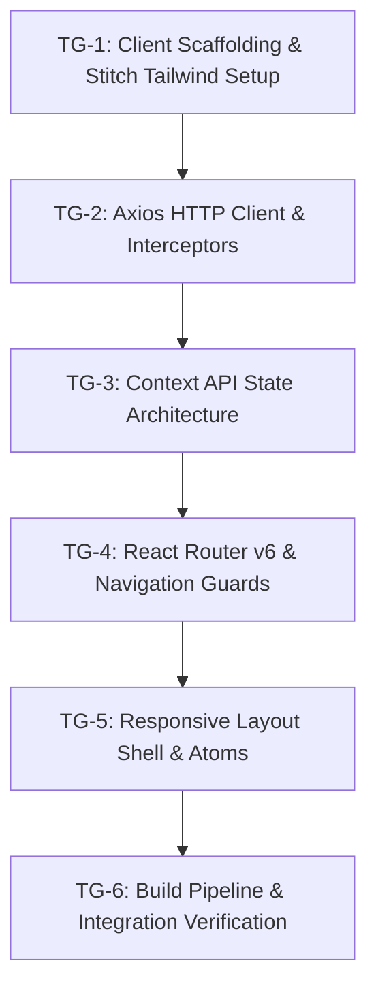

# Phase 3 Implementation Plan: Task Groups & Execution Order
## Frontend Architecture, State Management & Routing Engine

**Project**: Sylo (Project & Task Management App)  
**Phase**: Phase 3  
**Status**: Ready for Execution  
**Target Duration**: 1 Sprint  
**Prerequisites**: Phase 1 (Auth Backend) and Phase 2 (Project-Task API Backend) 100% complete and tested.  

---

## 1. Execution Overview & Task Group Breakdown

Phase 3 establishes the client single-page application framework, design tokens, authenticated communication pipeline, and navigation tree. It is divided into **6 logical Task Groups**:

| Task Group ID | Title | Primary Responsibility | Target Files |
| :--- | :--- | :--- | :--- |
| **TG-1** | Client Scaffolding & Stitch Tokens | Vite setup, Tailwind token injection, PostCSS, Google Fonts & Material Symbols | `client/package.json`, `vite.config.js`, `tailwind.config.js`, `index.html`, `src/index.css` |
| **TG-2** | Axios HTTP Client & Interceptor Engine | Axios instance, JWT request injection, 401 response handling, service modules | `client/src/services/api.js`, `authService.js`, `projectService.js`, `taskService.js` |
| **TG-3** | Context API State Architecture | `ToastContext`, `AuthContext`, `ProjectContext`, reactive metrics sync, custom hooks | `client/src/context/*`, `client/src/hooks/*` |
| **TG-4** | React Router v6 & Navigation Guards | Declarative routing tree, `<ProtectedRoute>`, redirect flow on unauthenticated access | `client/src/components/layout/ProtectedRoute.jsx`, `client/src/App.jsx` |
| **TG-5** | Responsive Layout Shell & Core Primitives | Authenticated `AppLayout` (Sidebar, Header), `AuthLayout`, Button, Input, Badge, Toast UI | `client/src/components/layout/*`, `client/src/components/common/*` |
| **TG-6** | Build Pipeline & State Verification | Verification of Vite compilation, Tailwind generation, route redirection, token lifecycle | `client/` automated build & manual validation suite |

---

## 2. Granular Task Group Specifications

### Task Group 1: Client Scaffolding & Stitch Tailwind Setup (TG-1)

#### 1.1 Objective
Initialize the `client/` directory with Vite, React 18, Tailwind CSS, PostCSS, and Autoprefixer. Inject Google Stitch design tokens into Tailwind configuration.

#### 1.2 Step-by-Step Implementation Steps
1. **Initialize `client/package.json`**:
   * Add dependencies: `react`, `react-dom`, `react-router-dom`, `axios`.
   * Add dev dependencies: `vite`, `@vitejs/plugin-react`, `tailwindcss`, `postcss`, `autoprefixer`.
   * Configure scripts: `"dev": "vite"`, `"build": "vite build"`, `"preview": "vite preview"`.
2. **Configure `client/vite.config.js`**:
   * Setup path alias `@` mapping to `client/src`.
   * Configure `/api` proxy targeting Express backend on `http://localhost:5000`.
3. **Configure `client/tailwind.config.js` & `client/postcss.config.js`**:
   * Inject all Stitch color tokens (`primary`, `primary-container`, `surface-container-*`, `on-surface`, `error-container`).
   * Add border radii (`DEFAULT`, `lg`, `xl`, `2xl`, `full`).
   * Setup font families (`Inter`, `JetBrains Mono`).
4. **Setup `client/index.html` & `client/src/index.css`**:
   * Import Google Fonts (`Inter`, `JetBrains Mono`, `Material Symbols Outlined`).
   * Add `@tailwind base; @tailwind components; @tailwind utilities;` with base body classes.

#### 1.3 Verification Checkpoint (TG-1)
* Running `npm.cmd run build` inside `client` produces clean production assets without missing token or PostCSS errors.
* Utility classes like `bg-primary-container`, `bg-surface-container-low`, `text-on-surface` apply the exact Stitch hex values.

---

### Task Group 2: Axios HTTP Client & Interceptor Engine (TG-2)

#### 2.1 Objective
Construct the centralized HTTP client with automatic Authorization header injection, 401 session expiration handling, and dedicated domain service modules.

#### 2.2 Step-by-Step Implementation Steps
1. **Implement `client/src/services/api.js`**:
   * Create Axios instance with `baseURL: import.meta.env.VITE_API_BASE_URL || '/api'`.
   * Add request interceptor: reads `sylo_token` from `localStorage`; if present, sets `config.headers.Authorization = 'Bearer ' + token`.
   * Add response interceptor: catches 401 errors, clears `sylo_token` and `sylo_user`, dispatches `sylo:session-expired` event, and redirects to `/login`.
2. **Implement `client/src/services/authService.js`**:
   * `login(credentials)`: calls `POST /api/auth/login`.
   * `register(data)`: calls `POST /api/auth/register`.
   * `verifyEmail(token)`: calls `GET /api/auth/verify-email/:token`.
   * `getMe()`: calls `GET /api/auth/me`.
   * `forgotPassword(email)`: calls `POST /api/auth/forgot-password`.
   * `resetPassword(token, passwords)`: calls `POST /api/auth/reset-password/:token`.
3. **Implement `client/src/services/projectService.js`**:
   * `getProjects(params)`: calls `GET /api/projects`.
   * `getProject(id)`: calls `GET /api/projects/:id`.
   * `createProject(data)`: calls `POST /api/projects`.
   * `updateProject(id, data)`: calls `PUT /api/projects/:id`.
   * `deleteProject(id)`: calls `DELETE /api/projects/:id`.
   * `addCollaborator(id, username)`: calls `POST /api/projects/:id/collaborators`.
   * `removeCollaborator(id, userId)`: calls `DELETE /api/projects/:id/collaborators/:userId`.
   * `leaveProject(id)`: calls `POST /api/projects/:id/leave`.
4. **Implement `client/src/services/taskService.js`**:
   * `getTasks(projectId, params)`: calls `GET /api/projects/:projectId/tasks`.
   * `createTask(projectId, data)`: calls `POST /api/projects/:projectId/tasks`.
   * `updateTask(taskId, data)`: calls `PUT /api/tasks/:taskId`.
   * `deleteTask(taskId)`: calls `DELETE /api/tasks/:taskId`.
   * `updateTaskStatus(taskId, status)`: calls `PATCH /api/tasks/:taskId/status`.

#### 2.3 Verification Checkpoint (TG-2)
* When a valid token is in `localStorage`, every outgoing Axios request automatically includes `Authorization: Bearer <token>`.
* A 401 response from the server purges stored credentials and triggers redirection to `/login`.

---

### Task Group 3: Context API State Architecture (TG-3)

#### 3.1 Objective
Implement lightweight, predictable state containers for UI notifications (`ToastContext`), user authentication (`AuthContext`), and workspace deliverables (`ProjectContext`).

#### 3.2 Step-by-Step Implementation Steps
1. **Implement `client/src/context/ToastContext.jsx` & `useToast.js`**:
   * State: `toasts` array.
   * Method `showToast(message, type, duration)` with auto-dismiss timer.
   * Method `removeToast(id)` for manual closing.
2. **Implement `client/src/context/AuthContext.jsx` & `useAuth.js`**:
   * State: `user`, `token`, `isAuthenticated`, `isLoading`.
   * Initialize state from `localStorage`.
   * Background `/api/auth/me` check to validate session freshness.
   * `login`, `register`, `logout` with storage synchronization.
   * Sync with `sylo:session-expired` custom event.
3. **Implement `client/src/context/ProjectContext.jsx` & `useProject.js`**:
   * State: `projects`, `activeProject`, `tasks`, `isLoadingProjects`, `isLoadingDetails`, `error`.
   * Handlers for project CRUD and task CRUD.
   * **Reactive metric recalculation**: when `updateTaskStatus` returns updated `projectMetrics`, synchronizes `activeProject.metrics` and update item in `projects` list immediately.
   * Optimistic / atomic collaborator unassignment on `removeCollaborator`.

#### 3.3 Verification Checkpoint (TG-3)
* `AuthContext` accurately reflects login/logout status across page reloads.
* Calling `showToast` enqueues an alert and clears it automatically after 4 seconds.
* `ProjectContext` keeps tasks and parent project progress metrics in sync.

---

### Task Group 4: React Router v6 & Navigation Guards (TG-4)

#### 4.1 Objective
Construct declarative route definitions with route-level authentication guards and query redirect memory.

#### 4.2 Step-by-Step Implementation Steps
1. **Implement `client/src/components/layout/ProtectedRoute.jsx`**:
   * Renders loading spinner if `isLoading === true`.
   * If `isAuthenticated === false`, redirects to `/login?redirect=<path>` preserving attempted destination.
   * If authenticated, renders `<Outlet />` or children.
2. **Implement Route Tree in `client/src/App.jsx`**:
   * Public Guest Routes: `/`, `/login`, `/register`, `/verify-email/:token`, `/forgot-password`, `/reset-password/:token`.
   * Protected Routes wrapped in `<ProtectedRoute>`:
     * `/dashboard`
     * `/projects`
     * `/projects/:id`
     * `/projects/:id/kanban`
     * `/projects/:id/members`
     * `/settings`
   * Catch-all route: `*` directing to `NotFoundPage`.

#### 4.3 Verification Checkpoint (TG-4)
* Directly browsing to `http://localhost:5173/dashboard` without a token immediately bounces the browser to `/login?redirect=%2Fdashboard`.
* Logging in successfully forwards the user back to the originally requested route.

---

### Task Group 5: Responsive Layout Shell & Core UI Primitives (TG-5)

#### 5.1 Objective
Build the authenticated workspace shell conforming to Google Stitch design screens: fixed desktop sidebar, sticky header with search, and responsive mobile bottom nav/drawer.

#### 5.2 Step-by-Step Implementation Steps
1. **Implement UI Atoms in `client/src/components/common/`**:
   * `Button.jsx`: variants (`primary`, `secondary`, `danger`, `ghost`), sizes (`sm`, `md`, `lg`), loading spinner.
   * `Input.jsx`: text, email, password fields with label, error display, and focus glow rings.
   * `Badge.jsx`: Stitch status pill badges for `Active`, `Almost Done`, `Completed`, and `Overdue`.
   * `Avatar.jsx`: User initials bubble with deterministic background colors.
   * `ProgressBar.jsx`: Continuous percentage progress bar with dynamic color transitions (blue -> teal -> green).
   * `Toast.jsx`: Visual container for active toast alerts with close button.
2. **Implement Shell Organisms in `client/src/components/layout/`**:
   * `Sidebar.jsx`: Desktop fixed sidebar (`w-64`) with brand logo, nav links (`Dashboard`, `Projects`, `Settings`), active highlight indicator, and bottom user mini-card.
   * `Header.jsx`: Sticky app header (`h-16`) with mobile menu toggle, search bar placeholder, and "+ New Project" quick action button.
   * `AppLayout.jsx`: Composed shell with `Sidebar`, `Header`, `<Outlet />`, and floating `Toast` overlay.
   * `AuthLayout.jsx`: Centered auth container on `#f8f9ff` canvas with Sylo logo.

#### 5.3 Verification Checkpoint (TG-5)
* Desktop viewport ($\ge 1024\text{px}$) displays fixed left sidebar and sticky header.
* Mobile viewport ($< 768\text{px}$) collapses sidebar and provides hamburger / slide-over drawer navigation.

---

### Task Group 6: Build Pipeline & Integration Verification (TG-6)

#### 6.1 Objective
Run end-to-end client build verification and integration smoke checks against the Phase 2 backend REST API.

#### 6.2 Step-by-Step Implementation Steps
1. **Verify Production Bundle**:
   * Execute `npm.cmd run build` inside `client/`. Ensure bundle size and chunking are optimized.
2. **Execute Authentication & Routing Smoke Verification**:
   * Verify registration -> email notice -> login -> token stored -> redirected to `/dashboard`.
   * Verify logging out purges token and returns to `/login`.
3. **Verify API Proxy & Interceptor**:
   * Test `/api/projects` call via Axios proxy; confirm Bearer token presence in network inspector.

#### 6.3 Verification Checkpoint (TG-6)
* 0 build errors or warnings.
* 100% adherence to Stitch styling tokens and PRD navigation requirements.
