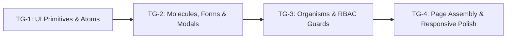

# Phase 4 Implementation Plan: Stitch UI Implementation & Polish
## Step-by-Step Execution Plan for Frontend UI Polish & Role-Based UI Rendering

**Project**: Sylo (Collaborative Project & Task Management App)  
**Phase**: Phase 4  
**Status**: Ready for Execution  
**Version**: 1.0  
**Role**: Lead Systems Architect  
**PRD Traceability**: Shared-interface principle (BR-15, FR-35, FR-36), Dashboard (FR-34), Tasks (FR-19-27), Deadlines (FR-28-30), Progress (FR-32-33), Feedback (FR-37-39).

---

## 1. Execution Overview & Task Group Breakdown

Phase 4 breaks down the complete UI implementation into four structured, sequential task groups designed to minimize regressions and ensure strict token adherence:

* **TG-1: Stitch UI Primitives & Atomic Components**: Foundational atoms with Google Stitch tokens (buttons, inputs, status pills, avatars, progress bars, skeletons).
* **TG-2: Composite Molecules, Forms & Modals**: Reusable interactive molecules, accessible dialogs, and create/edit modals (Project modal, Task modal with multi-assignee picker, confirmation modal).
* **TG-3: Organisms & Role-Based Action Guards**: Complex organisms (`ProjectHeader`, `TaskTable`, `KanbanBoard`, `CollaboratorManager`) with declarative RBAC guards enforcing the Shared-Interface Principle.
* **TG-4: Full Page Assembly, Responsive Polish & Loading/Error States**: Integrating atoms, molecules, and organisms into all workspace pages with comprehensive skeleton screens, responsive touch navigation, and build verification.

---

## 2. Task Group 1 (TG-1): Stitch UI Primitives & Atomic Components

### 2.1 Scope & Objective
Establish the foundational Atomic UI primitives under `frontend/src/components/common/`. These components standardize styling, states (default, hover, focus, disabled, loading), and accessibility across the entire app.

### 2.2 Files to Create / Modify
* `frontend/src/components/common/Button.jsx`
* `frontend/src/components/common/Input.jsx`
* `frontend/src/components/common/Badge.jsx`
* `frontend/src/components/common/Avatar.jsx`
* `frontend/src/components/common/ProgressBar.jsx`
* `frontend/src/components/common/Skeleton.jsx`
* `frontend/src/utils/formatters.js` (helpers for dates, overdue check, initials)

### 2.3 Detailed Steps
1. **Implement `Button.jsx`**:
   - Support variants: `primary`, `secondary`, `danger`, `ghost`.
   - Support sizes: `sm`, `md`, `lg`.
   - Implement `isLoading` spinner state with SVG circle animation that disables interactions and maintains button dimensions.
   - Support optional `icon` (Material Symbols) on left or right.
2. **Implement `Input.jsx`**:
   - Render floating or stacked label, optional icon prefix, validation error message, and helper text.
   - Implement proper focus ring (`focus:ring-2 focus:ring-primary/20`) and error ink states (`border-error`).
3. **Implement `Badge.jsx`**:
   - Tokenized status styles: `Active` (`primary-fixed`), `Almost Done` (`tertiary-fixed`), `Completed` (`#e6f4ea / #137333`), and `Overdue` (`error-container`).
   - Tokenized priority styles: `High` (`error-container`), `Medium` (`primary-fixed`), `Low` (`surface-container-high`).
4. **Implement `Avatar.jsx` & `AvatarGroup`**:
   - Extract uppercase initials from name/username.
   - Deterministic background color palette derived from username hash.
   - `AvatarGroup` with stacked negative margin (`-space-x-2`) and overflow badge (`+N`).
5. **Implement `ProgressBar.jsx`**:
   - Smooth CSS width transition.
   - Color grading based on progress threshold (0-74% primary, 75-99% tertiary, 100% emerald).
6. **Implement `Skeleton.jsx`**:
   - Shimmer animation using Tailwind pulse and `surface-container` background.
   - Specialized variants: text line, avatar circle, card box, table row.
7. **Implement `formatters.js`**:
   - Date formatters (`formatDate`, `formatRelativeDate`, `isOverdue`).
   - Initial generator and progress calculator safely guarding against division by zero (BR-12).

### 2.4 Definition of Done (TG-1)
- All 6 atom components render independently without CSS or lint errors.
- Passing props alters variants, states, and sizes cleanly.

---

## 3. Task Group 2 (TG-2): Composite Molecules, Forms & Modals

### 3.1 Scope & Objective
Construct higher-order UI molecules and modal dialogs that compose the atoms from TG-1 into interactive units with client validation and loading indicators.

### 3.2 Files to Create / Modify
* `frontend/src/components/common/Modal.jsx`
* `frontend/src/components/common/ConfirmDialog.jsx`
* `frontend/src/components/molecules/MetricCard.jsx`
* `frontend/src/components/molecules/ProjectCard.jsx`
* `frontend/src/components/molecules/TaskCard.jsx`
* `frontend/src/components/modals/ProjectModal.jsx`
* `frontend/src/components/modals/TaskModal.jsx`

### 3.3 Detailed Steps
1. **Implement `Modal.jsx`**:
   - Accessible backdrop overlay with blur (`bg-on-surface/40 backdrop-blur-xs`).
   - `ESC` key press listener and click-outside dismissal.
   - Header with title, close button, body, and action footer.
2. **Implement `ConfirmDialog.jsx`**:
   - Specialized modal for destructive confirmations (delete project, delete task, remove collaborator, leave project).
   - Prominent danger icon, warning message, `Cancel` and `Confirm` buttons with `isLoading` support.
3. **Implement `MetricCard.jsx`**:
   - Displays statistical KPI cards for dashboard (icon bubble, title, large counter, optional trend).
4. **Implement `ProjectCard.jsx`**:
   - Stitch surface card with title, description snippet, status badge, role pill, progress bar, task counter, and action menu.
5. **Implement `TaskCard.jsx`**:
   - Kanban board card with priority badge, title, description, deadline with overdue indicator, and assignee avatars.
6. **Implement `ProjectModal.jsx`**:
   - Supports both `Create` and `Edit` modes.
   - Form fields: Title, Description, Deadline.
   - Validates required title and deadline format.
7. **Implement `TaskModal.jsx`**:
   - Fields: Title, Description, Priority (`Low`, `Medium`, `High`), Deadline.
   - **Multi-Assignee Selector**: Dropdown showing verified project members with checkboxes or clickable pills; displays avatars and usernames.
   - Handles submission via `createTask` or `updateTask` with button loading state.

### 3.4 Definition of Done (TG-2)
- Modals trap focus, close on overlay/esc, and handle form submission errors gracefully.
- `TaskModal` accurately lists project members for assignment and supports multiple selections.

---

## 4. Task Group 3 (TG-3): Organisms & Role-Based Action Guards

### 4.1 Scope & Objective
Implement complex organisms and declarative role guards enforcing the **Shared-Interface Principle (FR-35, FR-36, BR-15)** across all project and task views.

### 4.2 Files to Create / Modify
* `frontend/src/components/guards/ProjectAdminGuard.jsx`
* `frontend/src/components/guards/TaskAssigneeGuard.jsx`
* `frontend/src/components/organisms/ProjectHeader.jsx`
* `frontend/src/components/organisms/TaskTable.jsx`
* `frontend/src/components/organisms/KanbanBoard.jsx`
* `frontend/src/components/organisms/CollaboratorManager.jsx`

### 4.3 Detailed Steps
1. **Implement `ProjectAdminGuard.jsx`**:
   - Evaluates whether the authenticated user is the Owner/Admin of the project (`activeProject.role === 'Admin' || activeProject.role === 'admin'`).
   - If admin: renders children. If collaborator: renders `fallback` (or `null`).
2. **Implement `TaskAssigneeGuard.jsx`**:
   - Evaluates whether the user is an Admin OR assigned to the task (`task.assignees.some(a => a.id === user.id || a === user.id)`).
   - Gates task status mutation controls (FR-27, BR-10).
3. **Implement `ProjectHeader.jsx`**:
   - Displays project title, description, status badge, overdue indicator, progress bar, and deadline.
   - Action controls:
     - "Edit Project" (Admin only via `ProjectAdminGuard`).
     - "Delete Project" (Admin only via `ProjectAdminGuard`, triggers `ConfirmDialog`).
     - "Leave Project" (Collaborators only, triggers `ConfirmDialog`).
     - "New Task" button (Admin only via `ProjectAdminGuard`).
     - View switchers: "List / Details", "Kanban Board", "Team Members".
4. **Implement `TaskTable.jsx`**:
   - Search filter and status tabs (`ALL`, `To Do`, `In Progress`, `Completed`).
   - Table columns: Status / Checkbox, Title & Description, Priority Badge, Assignees (`AvatarGroup`), Deadline, Actions.
   - Status toggle: interactive dropdown or checkmark for Assignees/Admins; read-only badge with tooltip for unassigned Collaborators.
   - Action column: "Edit" and "Delete" icons visible strictly to Admins (`ProjectAdminGuard`).
5. **Implement `KanbanBoard.jsx`**:
   - 3 columns (`To Do`, `In Progress`, `Completed`).
   - Column counter bubbles and color-coded status headers.
   - Quick column move controls ("Next", "Prev") enabled for Assignees/Admins; non-assignees see disabled move controls with informational tooltip.
6. **Implement `CollaboratorManager.jsx`**:
   - Member roster table (Name, Username, Email, Role pill).
   - "Add Collaborator" form (visible strictly to Admin; invites by `@username` with instant feedback).
   - "Remove Collaborator" action with `ConfirmDialog` (Admin only; owner cannot be removed).

### 4.4 Definition of Done (TG-3)
- Switching between an Admin account and a Collaborator account displays identical visual layouts, but hides/disables Admin-only actions cleanly.
- Collaborators cannot see "Delete Project", "New Task", "Add Collaborator", or edit unassigned tasks.

---

## 5. Task Group 4 (TG-4): Full Page Assembly, Responsive Polish & Final Verification

### 5.1 Scope & Objective
Wire the organisms and molecules into the final workspace pages (`DashboardPage`, `ProjectsPage`, `ProjectDetailsPage`, `KanbanPage`, `TeamMembersPage`, `SettingsPage`), enforce comprehensive loading skeletons, tune responsive navigation, and verify production build.

### 5.2 Files to Create / Modify
* `frontend/src/pages/DashboardPage.jsx`
* `frontend/src/pages/ProjectsPage.jsx`
* `frontend/src/pages/ProjectDetailsPage.jsx`
* `frontend/src/pages/KanbanPage.jsx`
* `frontend/src/pages/TeamMembersPage.jsx`
* `frontend/src/pages/SettingsPage.jsx`
* `frontend/src/components/layout/Sidebar.jsx`
* `frontend/src/components/layout/Header.jsx`

### 5.3 Detailed Steps
1. **Refactor `DashboardPage.jsx`**:
   - Integrate `MetricCard` with shimmer skeleton during fetch.
   - Display dynamic project cards using `ProjectCard`.
   - Show recent tasks and quick navigation links.
2. **Refactor `ProjectsPage.jsx`**:
   - Integrate `ProjectModal` for creating new projects.
   - Integrate `ProjectCard` grid with search and status filtering.
   - Add empty-state illustrations when no projects match.
3. **Refactor `ProjectDetailsPage.jsx`**:
   - Integrate `ProjectHeader`, `TaskTable`, `TaskModal`, and `ConfirmDialog`.
   - Add full table skeletons during data load.
4. **Refactor `KanbanPage.jsx`**:
   - Integrate `KanbanBoard` organism.
   - Add smooth column scrolling for mobile viewports.
5. **Refactor `TeamMembersPage.jsx`**:
   - Integrate `CollaboratorManager` organism and `ConfirmDialog`.
6. **Polish `Sidebar.jsx` & `Header.jsx`**:
   - Ensure mobile touch drawer operates with smooth backdrop blur and auto-closes on route changes.
   - Add active route indicator with Stitch tokens.
7. **Run Build Verification**:
   - Execute `npm.cmd run build` inside `frontend/` to confirm zero lint, import, or syntax errors.

### 5.4 Definition of Done (TG-4)
- All pages feature responsive layouts, loading skeletons, and role-based permissions.
- Production build passes with exit code 0.
