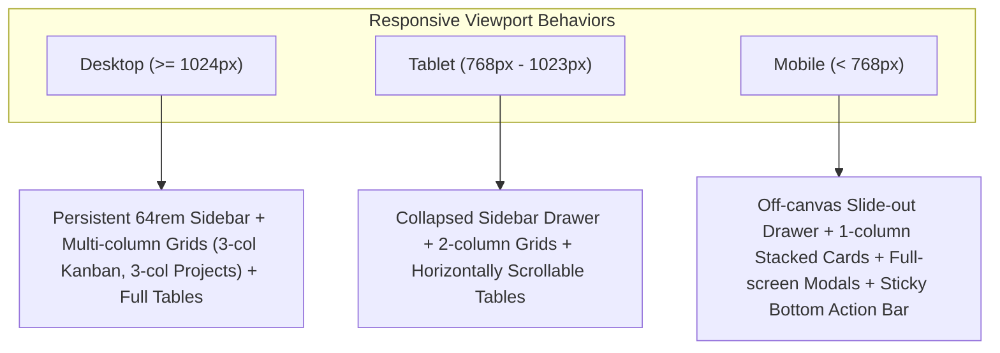

# Phase 4 Technical Specification: Requirements & Architecture
## Stitch UI Implementation, Component Topology & Role-Based UI Polish

**Project**: Sylo (Collaborative Project & Task Management App)  
**Phase**: Phase 4  
**Status**: Specification Draft  
**Version**: 1.0  
**Role**: Lead Systems Architect  
**PRD Traceability**: Shared-interface principle (BR-15, FR-35, FR-36), Dashboard requirements (FR-34), Task assignments & mutations (FR-19-27, BR-05-11), Progress & Deadlines (FR-28-33, BR-12-14), Validation & User Feedback (FR-37-39, AC-14), Google Stitch Project `17067369580908098964`.

---

## 1. System Vision & Architecture Paradigm

Phase 4 transforms the functional scaffolding and state engines of Phase 3 into a pixel-perfect, highly responsive, production-grade user experience built upon the **Google Stitch Design System** tokens and Atomic Component Architecture.

### Core Architectural Tenets:
1. **The Shared-Interface Principle (FR-35, BR-15)**:
   Admins and Collaborators experience the exact same unified workspace topology, visual layouts, and information hierarchy. Role distinctions are manifested purely through contextual permission gates that selectively reveal, hide, or disable privileged action controls (e.g., project deletion, task creation/assignment, deadline modification) while maintaining interface symmetry.
2. **Defensive UI Layering (FR-36)**:
   Frontend UI permission gating is strictly a user-experience enhancement. Every interactive guard mirrors backend RBAC middleware (`requireProjectAdmin`, `requireTaskAssigneeOrAdmin`), preventing visual affordances for unauthorized operations while remaining resilient against client manipulation.
3. **Deterministic Feedback & Micro-States (FR-38, FR-39, AC-14)**:
   Every asynchronous boundary (REST mutation, data fetch, background status transition) provides deterministic feedback: structural skeleton screens during fetches, inline micro-spinners in buttons during mutations, empty-state illustrations when collections are void, and non-intrusive auto-dismissing toast alerts for error/success notifications.
4. **Fluid Cross-Device Responsiveness (FR-39)**:
   Fluid layout scaling spanning ultra-wide desktop monitors down to mobile viewports (`< 768px`) with off-canvas touch navigation drawers, adaptive modal viewports, and stacked column layouts.

---

## 2. Component Topology (Atomic Hierarchy)

The client presentation layer is structured using Atomic Design methodology to guarantee high modularity, zero CSS duplication, and strict token adherence.

```mermaid
flowchart TD
    subgraph Atoms["UI Primitives (Atoms)"]
        A1["Button.jsx (Variants: Primary, Secondary, Danger, Ghost)"]
        A2["Input.jsx & TextArea.jsx (Floating Label, Error Inks)"]
        A3["Badge.jsx (Status: Active, Almost Done, Completed, Overdue)"]
        A4["Avatar.jsx & AvatarGroup.jsx (Initials, Tooltip)"]
        A5["ProgressBar.jsx (Fluid SVG/CSS Bar)"]
        A6["Skeleton.jsx (Shimmer Screen Placeholders)"]
        A7["Icon.jsx (Material Symbols Outlined Wrapper)"]
    end

    subgraph Molecules["Composite Components (Molecules)"]
        M1["MetricCard.jsx (Counter, Icon, Stitch Card)"]
        M2["ProjectCard.jsx (Progress, Badges, Role Pill)"]
        M3["TaskCard.jsx (Kanban Item, Priority Pill, Assignee Badges)"]
        M4["TaskRow.jsx (Table List Item, Quick Status Toggle)"]
        M5["UserPill.jsx (Collaborator Badge with Remove Action)"]
        M6["SearchFilterBar.jsx (Live Query, Status Tabs)"]
        M7["ConfirmDialog.jsx (Destructive Action Modal Shell)"]
    end

    subgraph Organisms["Domain Organisms (Organisms)"]
        O1["ProjectHeader.jsx (Title, RBAC Action Group, Progress)"]
        O2["TaskTable.jsx (Sortable, Searchable Task List)"]
        O3["KanbanBoard.jsx (3 Columns: To Do, In Progress, Completed)"]
        O4["CollaboratorManager.jsx (Roster Table, Username Invite)"]
        O5["ProjectModal.jsx (Create / Edit Project Form)"]
        O6["TaskModal.jsx (Create / Edit Task Form, Multi-Assignee Picker)"]
        O7["Sidebar.jsx & Header.jsx (App Layout Navigation)"]
    end

    subgraph Pages["Pages & Views"]
        P1["DashboardPage.jsx"]
        P2["ProjectsPage.jsx"]
        P3["ProjectDetailsPage.jsx"]
        P4["KanbanPage.jsx"]
        P5["TeamMembersPage.jsx"]
    end

    Atoms --> Molecules
    Molecules --> Organisms
    Organisms --> Pages
```



---

## 3. UI Primitive Specifications (Atoms & Molecules)

### 3.1 Atoms Specification

#### 1. `Button.jsx` (`src/components/common/Button.jsx`)
Universal button component implementing Google Stitch button hierarchies, micro-loading spinners, and disabled states.
* **Props**:
  * `variant`: `'primary'` (`bg-primary text-on-primary hover:bg-primary/90`), `'secondary'` (`bg-surface-container text-on-surface hover:bg-surface-container-high`), `'danger'` (`bg-error text-on-error hover:bg-error/90`), `'ghost'` (`hover:bg-surface-container-low text-on-surface-variant`).
  * `size`: `'sm'` (py-1.5 px-3 text-xs), `'md'` (py-2 px-4 text-xs font-semibold), `'lg'` (py-2.5 px-5 text-sm font-semibold).
  * `isLoading`: `boolean` (renders spinner atom, disables pointer events, retains button geometry).
  * `disabled`: `boolean` (`opacity-50 cursor-not-allowed`).
  * `icon`: `string` (Material Symbol icon name to prepend).
  * `iconPosition`: `'left' | 'right'`.

#### 2. `Input.jsx` (`src/components/common/Input.jsx`)
Standardized text input with label, helper text, and error states.
* **Props**:
  * `label`: Field caption rendered with `text-xs font-semibold text-on-surface mb-1.5`.
  * `error`: Error message string. If present, border shifts to `border-error`, ring to `focus:ring-error/20`, and displays error text with `error` icon.
  * `icon`: Optional leading icon (e.g. `search`, `mail`, `lock`).
  * `required`: Appends asterisk `*` in error ink.

#### 3. `Badge.jsx` (`src/components/common/Badge.jsx`)
Tokenized status indicator pill enforcing PRD color specifications:
* **Variants**:
  * `Active`: `bg-primary-fixed text-on-primary-fixed`
  * `Almost Done`: `bg-tertiary-fixed text-on-tertiary-fixed`
  * `Completed`: `bg-[#e6f4ea] text-[#137333]`
  * `Overdue`: `bg-error-container text-on-error-container font-semibold animate-pulse`
  * `Priority-High`: `bg-error-container text-on-error-container`
  * `Priority-Medium`: `bg-primary-fixed text-on-primary-fixed`
  * `Priority-Low`: `bg-surface-container-high text-on-surface-variant`
  * `Role-Admin`: `bg-primary-fixed text-on-primary-fixed font-semibold`
  * `Role-Collaborator`: `bg-surface-container text-outline`

#### 4. `Avatar.jsx` & `AvatarGroup.jsx` (`src/components/common/Avatar.jsx`)
Extracts initials from user `name` or `username`. Formats circular pill with consistent deterministic color derivation.
* **Size**: `sm` (24px), `md` (32px), `lg` (40px).
* **AvatarGroup**: Renders stacked overlapping avatars (`-space-x-2`) with `+N` overflow counter bubble.

#### 5. `ProgressBar.jsx` (`src/components/common/ProgressBar.jsx`)
Visualizes project progress percentage (BR-12, Section 9.1).
* **Props**:
  * `progress`: Integer `0` to `100`.
  * `size`: `'sm'` (h-1.5), `'md'` (h-2), `'lg'` (h-3).
  * `showLabel`: `boolean` (displays `progress%` inline or header).
  * Color dynamically adapts:
    * `0-74%`: `bg-primary`
    * `75-99%`: `bg-tertiary` (Almost Done)
    * `100%`: `bg-[#137333]` (Completed)

#### 6. `Skeleton.jsx` (`src/components/common/Skeleton.jsx`)
Shimmering placeholder blocks for seamless perceived performance during initial data fetches (FR-39).
* Supports `variant="card"`, `variant="text"`, `variant="avatar"`, `variant="table-row"`.

---

## 4. Shared-Interface Principle & Role-Based UI Rendering

### 4.1 Permission Matrix & UI Rendering Rules
The PRD strictly mandates that Admins and Collaborators share identical screens and data models, with action triggers rendered or disabled conditionally based on user role and task assignments.

| Screen / Feature | Element / Action | Admin / Owner | Collaborator | UI State for Collaborator |
| :--- | :--- | :--- | :--- | :--- |
| **Project Details Header** | "Edit Project" Button | Visible & Active | Hidden | Element omitted from header button group |
| **Project Details Header** | "Delete Project" Button | Visible & Active | Hidden | Element omitted (Destructive shared action BR-03) |
| **Project Details Header** | "Leave Project" Button | Hidden (Owner) | Visible & Active | Visible with self-removal confirm dialog |
| **Project Details Header** | "New Task" Button | Visible & Active | Hidden | Element omitted (Task creation is Admin-only FR-19) |
| **Task Table / Details** | "Delete Task" Icon | Visible & Active | Hidden | Element omitted from row action cell |
| **Task Table / Details** | "Edit Task / Assignees" | Visible & Active | Hidden | Collaborators cannot change assignees/deadlines (FR-25, FR-29) |
| **Task Status Toggle** | Assigned Task Status | Visible & Active | Visible & Active | Dropdown/Checkmark interactive (FR-27, BR-10) |
| **Task Status Toggle** | Unassigned Task Status | Visible & Active | Disabled / Read-only | Status displayed as static badge or disabled dropdown with tooltip: *"Only assignees can update status"* |
| **Team Members Page** | "Add Collaborator" Form | Visible & Active | Hidden | Invitation form omitted (FR-14) |
| **Team Members Page** | "Remove Collaborator" | Visible & Active | Hidden | Remove buttons omitted from roster list (FR-15) |
| **Kanban Board** | Column Move Action | Visible & Active (Any) | Active (Only Assigned) | If not assigned to task, drag/move controls disabled with tooltip |

### 4.2 Reusable UI Permission Guard Components

To keep JSX declarative and prevent role-checking boilerplate across components, two specialized UI guards will be established:

#### 1. `<ProjectAdminGuard>`
```jsx
// Renders children only if current user is the owner/admin of the active project
<ProjectAdminGuard fallback={null}>
  <Button variant="danger" onClick={handleDeleteProject}>
    Delete Project
  </Button>
</ProjectAdminGuard>
```

#### 2. `<TaskAssigneeGuard>`
```jsx
// Renders interactive status controls if user is Admin OR assigned to the task
<TaskAssigneeGuard task={task} fallback={<Badge status={task.status} />}>
  <TaskStatusDropdown task={task} onChange={handleStatusUpdate} />
</TaskAssigneeGuard>
```

---

## 5. Organisms & Interactive Modals

### 5.1 `TaskModal.jsx` (Task Creation & Assignment Organism)
Implements requirements FR-19, FR-22, FR-23, FR-24:
* **Fields**:
  * Title (`required`, 3-100 characters)
  * Description (optional textarea)
  * Priority (`Low`, `Medium`, `High`)
  * Deadline date picker
  * **Multi-Assignee Picker**: Dropdown populated strictly with verified project members (Owner + Collaborators). Allows selecting multiple assignees or self-assigning. Prevents assigning non-members (FR-24).
* **Feedback**: Submitting displays inline loading spinner on button, disables inputs, and triggers toast notification upon completion.

### 5.2 `ProjectModal.jsx` (Project Creation & Metadata Organism)
Implements requirements FR-09, FR-12:
* **Fields**:
  * Title (`required`, 3-80 characters)
  * Description (optional textarea)
  * Deadline date picker
* **Behavior**: Auto-populates existing values when in "Edit" mode; clears upon create.

### 5.3 `ConfirmDialog.jsx` (Accessible Destructive Confirmation)
Accessible modal with backdrop blur preventing accidental data deletion:
* Used for: Project Deletion, Task Deletion, Collaborator Removal, Leaving Project.
* Visual hierarchy: Inks styled with `bg-error-container text-on-error-container` warning header, confirm button styled with `variant="danger"`.

---

## 6. Feedback, Micro-Interactions & Responsive Architecture

### 6.1 Deterministic Loading States (FR-39)
* **Initial Page Mounts**: Page layouts load `<Skeleton>` pulse mockups for cards, charts, and table rows instead of jarring white screens.
* **Form Submissions**: Action buttons render a CSS SVG spinner, change text (e.g. `"Saving..."`), and set `disabled={true}` to prevent double submissions.
* **Inline Task Updates**: When moving tasks on the Kanban board or toggling table checkboxes, the card displays a subtle pulse indicator until API response resolves.

### 6.2 Error Display & Validation Hierarchy (FR-37, FR-38)
* **Client-Side Form Errors**: Fields validate on blur/submit, rendering red outlines and explicit helper messages beneath inputs.
* **Backend Error Envelopes**: Errors from API responses (`err.response.data.message` or express-validator `errors` array) are surfaced immediately via `ToastContext` (`type="error"`).
* **Network / 401 Disconnections**: Handled by Axios interceptor; toast warns user *"Session expired, redirecting to login"*.

### 6.3 Responsive Breakpoint Layout Matrix (FR-39)



* **Desktop (`>= 1024px`)**:
  * Persistent fixed sidebar (`w-64`).
  * 3-column Kanban board side-by-side.
  * Comprehensive table layouts with assignees, dates, and badges visible without horizontal scroll.
* **Tablet (`768px - 1023px`)**:
  * Sidebar transitions to toggleable drawer.
  * Kanban board allows horizontal touch swipe/scroll.
  * Grid cards collapse to 2 columns.
* **Mobile (`< 768px`)**:
  * Off-canvas hamburger menu drawer with smooth translate animation.
  * Tables adapt to card-based rows for touch ergonomics.
  * Modals render full-screen sheets (`w-full h-full sm:h-auto sm:max-w-lg`).
  * Buttons expand to `w-full` for easy tap targets (`min-h-[44px]`).

---

## 7. Requirement Traceability Matrix

| Requirement ID | PRD Source | Phase 4 Architecture Component | Verification Method |
| :--- | :--- | :--- | :--- |
| **BR-15 / FR-35** | Shared-Interface Principle | `ProjectAdminGuard.jsx`, `TaskAssigneeGuard.jsx` | Manual role switching test |
| **FR-34** | Dashboard View | `DashboardPage.jsx`, `MetricCard.jsx` | Verify counts & role indicators |
| **FR-19-25** | Task Management & Assignees | `TaskModal.jsx`, `TaskTable.jsx`, `MultiAssigneePicker.jsx` | Admin creates & assigns tasks |
| **FR-27 / BR-10**| Task Status Mutation | `TaskStatusDropdown.jsx`, `TaskRow.jsx` | Collaborator mutates only assigned tasks |
| **FR-28-30** | Deadlines & Overdue States | `Badge.jsx`, `formatters.js`, `TaskCard.jsx` | Visual `Overdue` pill verification |
| **FR-32-33** | Dynamic Progress & Status | `ProgressBar.jsx`, `ProjectCard.jsx` | Progress recalculation on status change |
| **FR-38-39** | Feedback & Loading States | `Skeleton.jsx`, `Button.jsx`, `Toast.jsx` | Simulated network throttle testing |
