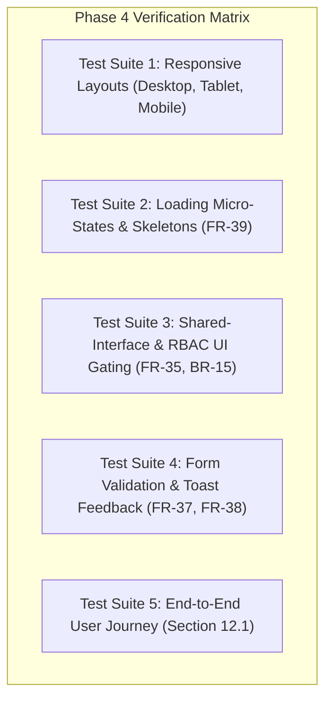

# Phase 4 Validation & Quality Assurance Specification
## Verification Suite for Stitch UI Implementation, Role-Based UI & Responsive Polish

**Project**: Sylo (Collaborative Project & Task Management App)  
**Phase**: Phase 4  
**Status**: Ready for Verification  
**Version**: 1.0  
**Role**: Lead Systems Architect  
**PRD Traceability**: Shared-interface principle (BR-15, FR-35, FR-36), Responsive UI (FR-39), Loading & Errors (FR-37-39, AC-14), Acceptance Criteria (AC-01 through AC-15, Section 12.1).

---

## 1. Quality Assurance Strategy & Test Matrix

Phase 4 validation focuses on verifying the visual fidelity, responsive ergonomics, loading feedback, and role-based action gating across user sessions.



---

## 2. Test Suite 1: Responsive Layout Verification (FR-39)

### 2.1 Test Case TC-RESP-01: Desktop Viewport (`>= 1024px`)
* **Preconditions**: Browser viewport set to `1280x800` or larger.
* **Procedure**:
  1. Navigate to `/dashboard`, `/projects`, `/projects/:id`, `/projects/:id/kanban`.
  2. Inspect sidebar behavior and navigation links.
  3. Inspect Kanban board and project card grids.
* **Expected Outcome**:
  - Sidebar is persistently visible (`w-64`, fixed on left) without overlapping content.
  - Kanban board renders all 3 columns (`To Do`, `In Progress`, `Completed`) side-by-side with no horizontal page body scrolling.
  - Projects grid renders in 3 columns (`grid-cols-3`).
  - Task table displays all columns (Status, Title, Priority, Assignees, Deadline, Actions) with ample horizontal spacing.

### 2.2 Test Case TC-RESP-02: Tablet Viewport (`768px` - `1023px`)
* **Preconditions**: Browser viewport set to `768x1024` (iPad portrait).
* **Procedure**:
  1. Verify top navigation bar and sidebar visibility.
  2. Click mobile hamburger toggle icon in `Header`.
  3. View Kanban board and Projects list.
* **Expected Outcome**:
  - Sidebar is hidden by default; hamburger icon appears in header.
  - Tapping hamburger opens slide-over drawer overlay (`z-50`) with backdrop blur.
  - Tapping a link or backdrop closes the drawer.
  - Projects grid collapses to 2 columns (`md:grid-cols-2`).
  - Kanban board columns maintain minimum width (`min-w-[280px]`) and allow smooth horizontal scrolling within the board container without breaking page layout.

### 2.3 Test Case TC-RESP-03: Mobile Viewport (`< 768px`)
* **Preconditions**: Browser viewport set to `375x812` (iPhone X/13).
* **Procedure**:
  1. Navigate across all pages using touch emulation.
  2. Open modals (`New Project`, `New Task`, `ConfirmDialog`).
* **Expected Outcome**:
  - Modals adapt to full width or bottom sheet style with comfortable tap targets (`min-h-[44px]`).
  - Project and task cards stack vertically in a single column (`grid-cols-1`).
  - Table view collapses non-essential columns or wraps into readable mobile card format.
  - No horizontal layout overflow (`overflow-x-hidden` on outer shell).

---

## 3. Test Suite 2: Loading States & Skeletons (FR-39, AC-14)

### 3.1 Test Case TC-LOAD-01: Page Mount Skeleton Shimmer
* **Preconditions**: Network throttling set to "Slow 3G" in DevTools Network tab.
* **Procedure**:
  1. Navigate directly to `/dashboard` or `/projects/:id`.
  2. Observe the interface while data fetch is pending.
* **Expected Outcome**:
  - The UI immediately renders pulsing `<Skeleton>` placeholders mirroring the cards, metric boxes, and table rows.
  - No blank white screens or flashing layout shifts occur.
  - Once data resolves, skeletons transition smoothly to populated data cards.

### 3.2 Test Case TC-LOAD-02: Form Mutation Button State
* **Preconditions**: User opens `New Project` or `New Task` modal.
* **Procedure**:
  1. Fill required fields and click Submit (`"Create Project"` or `"Create Task"`).
* **Expected Outcome**:
  - Submit button immediately enters loading state:
    - Button text changes to `"Creating..."` or displays an inline SVG spinner.
    - Pointer events are disabled (`disabled={true}`, `opacity-60`).
    - Multiple rapid clicks do not trigger duplicated API requests.
  - Modal automatically closes only after API response succeeds.

### 3.3 Test Case TC-LOAD-03: Inline Task Status Transition
* **Preconditions**: User changes task status on Kanban board or Task table.
* **Procedure**:
  1. Click "Next" on a Kanban card under "To Do" to move to "In Progress".
* **Expected Outcome**:
  - Card displays instant optimistic or localized loading indicator.
  - Parent project progress bar in `ProjectHeader` recalculates and updates smoothly without a full page reload.

---

## 4. Test Suite 3: Shared-Interface Principle & Role-Based UI Gating (FR-35, FR-36, BR-15)

### 4.1 Test Case TC-RBAC-01: Project Details Header Gating
* **Setup**: Create Project X with **User A** (Admin) and invite **User B** (Collaborator).
* **Procedure**: Compare `/projects/:id` viewed by User A vs. User B.
* **Expected Outcome**:

| UI Control | User A (Admin) View | User B (Collaborator) View | Verification Pass Criteria |
| :--- | :--- | :--- | :--- |
| **Project Title & Description** | Visible & Identical | Visible & Identical | Shared interface matches exactly |
| **Progress Bar & Deadline** | Visible & Identical | Visible & Identical | Shared metrics visible to all |
| **"New Task" Button** | Visible | **Hidden** | Collaborator cannot trigger task creation (FR-19) |
| **"Delete Project" Icon/Button** | Visible | **Hidden** | Collaborator cannot delete shared project (BR-03) |
| **"Leave Project" Button** | Hidden | **Visible** | Collaborator can leave shared project (BR-04) |

### 4.2 Test Case TC-RBAC-02: Task Mutation & Assignment Gating
* **Setup**: User A creates Task 1 assigned to User B, and Task 2 assigned only to User A.
* **Procedure**: Log in as User B and inspect Task 1 and Task 2.
* **Expected Outcome**:
  - **Task 1 (Assigned to User B)**:
    - Status dropdown/toggle is interactive. User B can change status (`To Do` &rarr; `In Progress` &rarr; `Completed`) (FR-27).
    - Edit/Delete buttons are hidden (FR-21).
  - **Task 2 (Not assigned to User B)**:
    - Status control is **disabled or read-only badge** with tooltip: *"Only assigned members can update this task"* (FR-27, BR-10).
    - Edit/Delete buttons are hidden (FR-21).

### 4.3 Test Case TC-RBAC-03: Collaborators Page Gating
* **Setup**: User A and User B open `/projects/:id/members`.
* **Expected Outcome**:
  - **User A (Admin)**:
    - "Add Collaborator by username" input form is visible and interactive (FR-14).
    - "Remove" button is visible beside User B in the roster (FR-15).
  - **User B (Collaborator)**:
    - "Add Collaborator" form is completely hidden.
    - "Remove" buttons are completely hidden on all roster members.
    - "Leave Project" action button is available.

---

## 5. Test Suite 4: Form Validation & Toast Feedback (FR-37, FR-38)

### 5.1 Test Case TC-VAL-01: Empty & Malformed Input Handling
* **Procedure**:
  1. Open `New Project` modal and click Submit with empty title.
  2. Open `New Task` modal and submit empty title.
  3. Enter invalid date (e.g. past deadline where disallowed or malformed).
* **Expected Outcome**:
  - Input border changes to `border-error` with inline error message.
  - Toast alert pops up in top-right displaying user-friendly validation error.
  - No raw stack traces or Mongoose error messages are displayed (FR-38).

### 5.2 Test Case TC-VAL-02: Non-existent Collaborator Invite
* **Procedure**: In `TeamMembersPage`, submit username `"non_existent_user_9999"`.
* **Expected Outcome**:
  - Error toast appears: `"User not found with this username"` (FR-38).
  - Form remains open and allows correction without crashing or resetting other fields.

---

## 6. Test Suite 5: PRD End-to-End Acceptance Test (Section 12.1)

Execute the comprehensive 11-step end-to-end journey defined in PRD Section 12.1:

```
Step 1:  Register User A and User B; verify both emails.
Step 2:  Log in as User A; reach Dashboard.
Step 3:  User A creates Project "Capstone 2026".
Step 4:  User A invites User B via username. Confirm User B appears in roster.
Step 5:  User A creates Task 1 ("Design DB") assigned to User B.
         User A creates Task 2 ("Build API") assigned to User A and User B.
         User A sets deadlines.
Step 6:  Log in as User B; open Project "Capstone 2026". Confirm both tasks visible.
Step 7:  User B attempts to edit Project title or delete project -> Actions are hidden/unavailable.
Step 8:  User B updates Task 1 from "To Do" to "Completed".
Step 9:  Verify Project Progress updates to 50% ("Active").
Step 10: Log in as User A; confirm Task 1 is Completed and progress is 50%.
Step 11: User A removes User B from Task 2 -> User B remains in Project roster.
         User A removes User B from Project -> User B is automatically removed from all task assignments.
```

---

## 7. Sign-off Criteria & Milestone Gate

Phase 4 will be formally certified and approved when:
1. `npm.cmd run build` executes cleanly with 0 errors or warnings.
2. All 5 test suites pass manual verification across desktop and mobile viewports.
3. Role-based guards strictly satisfy PRD rules BR-01 through BR-15 without exposing unauthorized action buttons to Collaborators.
